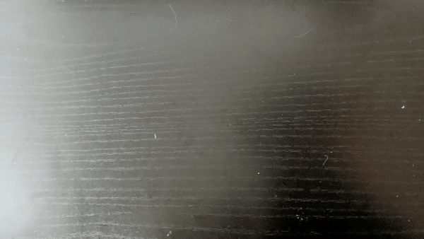

## Idea
I am very limited by supplies in my apartment -- so I wanted to play around with what I had: sticky notes. I toyed around with lots of different shapes but I figured, hey since it is a pink sticky not I should do something that is traditionally pink. I followed this basic theme of a heart and had multiple different cut-outs of what I thought I wanted to achieve.

## Setup
I also had issues with my tripod -- I ended up having to jury rig a phone mount from the tripod that I currently had.

I also had issues using stop motion pro on my desktop computer and my camera unfortunately was not supported. I ended up getting the free version on my phone.

## Theme
I wanted to have a theme of looping gifs that could work together to tell a story. This resulted in my two loops titled `Broken` and `Together`.

