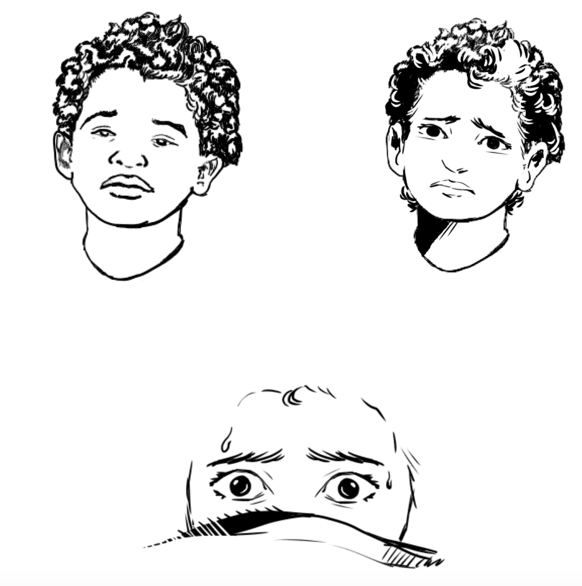
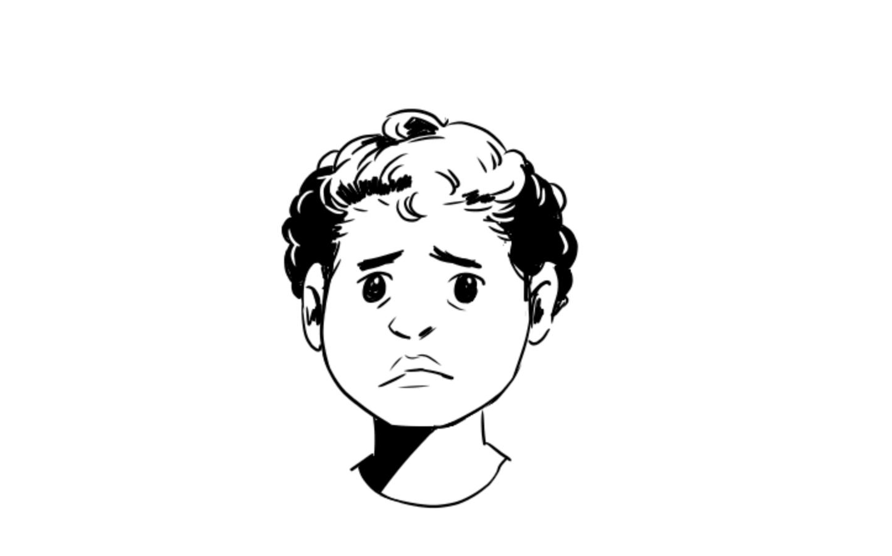

# Working Together

This week Mega Group figured out a good system for working together by breaking the assets down by scene and having one person work on part of the scene to have it be cohesive throughout the entire animation. 

# Work 
My part this week was working on the text and minor animations in each scenes. I took the first stanza from the poem:

    My closet is booming, 
    something's not right.
    The moon is looming, 
    shining real bright.

And created the first scenes we are introduced to as the audience.

`youtube: https://youtu.be/GdV5lwUl1gE`

`youtube: https://youtu.be/FP51RSlcfgQ`

These were both experiments in initial animation of the text. I also used the "wave" effect on the curtains to animate them pretty easily!

Eden and Meena also solidified a style for the character designs, going from a realistic character to a more cartoonish character:

We also solidified a plan with our storyboard, which you can see [here](https://docs.google.com/document/d/14sx11nm23F5pZOAc9rnBY-SmblrqBLTdTrxsFMRB9DY/edit) 