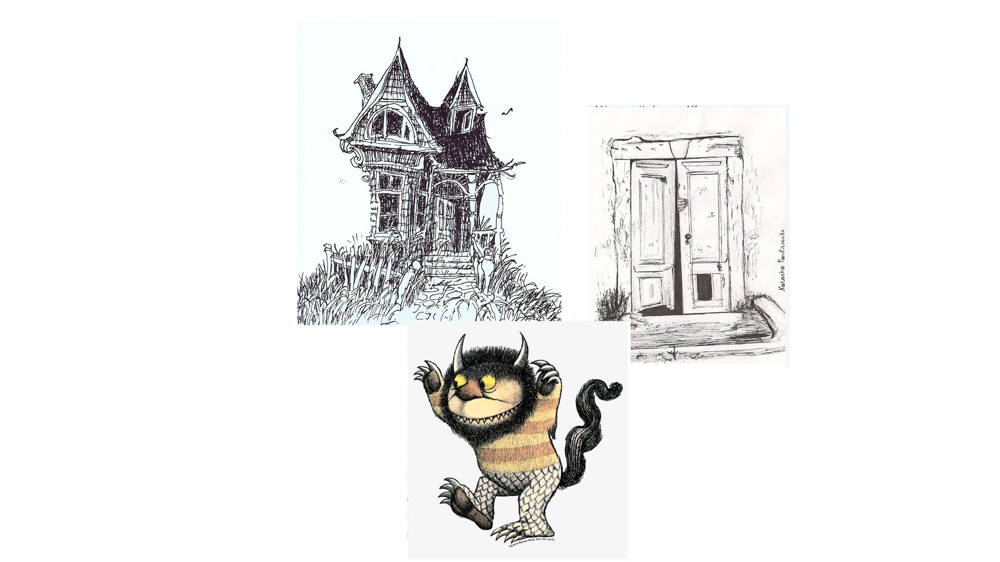
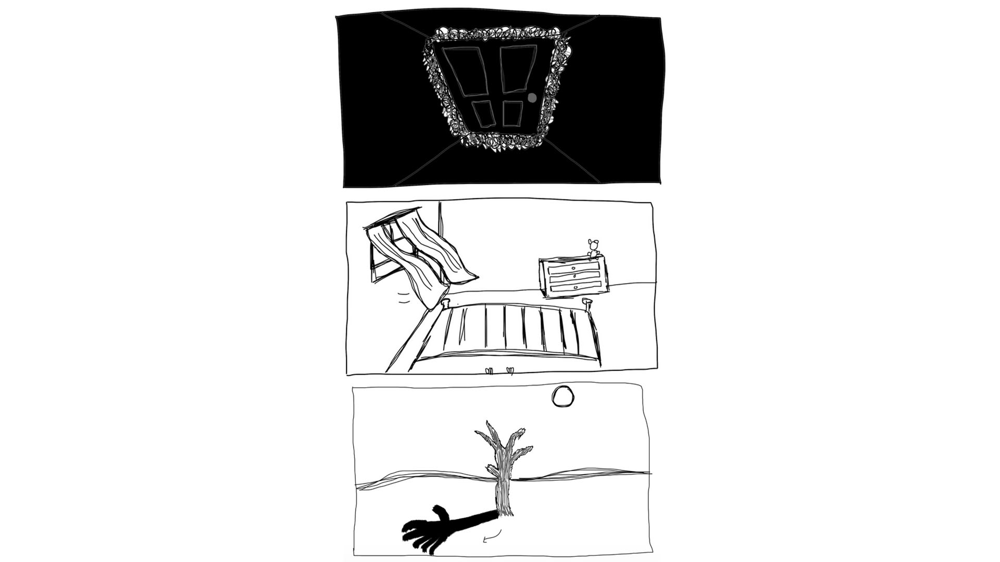

TLDR: [google doc link](https://docs.google.com/document/d/1c9Oznjak5a2E5llc3Vn_KMuBrBWjiunRhCeVb0J8FT8/edit?usp=sharing)

We are Mega Group and creating 2 sets of animations that are tackling a main theme of the transformation of childhood fears into adult ones. We have 1 poem and have derived a literal interpretation vs. a conceptual interpretation of it. Our team split up into two groups falling into the two concepts, and my group focused on the literal poem.

    CLOSET

    My closet is booming,
    something's not right.
    The moon is looming,
    shining real bright.
    Shadows dance across the bedroom floor,
    slowly creeping towards my closet door.

    My palms are sweaty,
    gripping the sheets.
    My heart is heavy,
    I can't fall asleep.

    I shut my eyes then open them brave,
    There are toys in the closet I must hurry to save.
    Barbie and Ken, Rick and Morty and friends,
    I promise we will be united by the night's end.

    I muster up courage, emerge from under the covers.
    Then POP!
    Out of the closet jumps my older brother.

My first thoughts on reading it brought me back to reading Shel Silverstein as a child. So I rolled with that. I brought together some mood that I thought I wanted to achieve. 

From that inspiration I wanted to use bold black and white lines to achieve a very stark look. 

This was only my part of the project and my specific interpretation of it. But if you would like to see the collaborative work please check out this [google doc](https://docs.google.com/document/d/1c9Oznjak5a2E5llc3Vn_KMuBrBWjiunRhCeVb0J8FT8/edit?usp=sharing) available for NYU addresses.