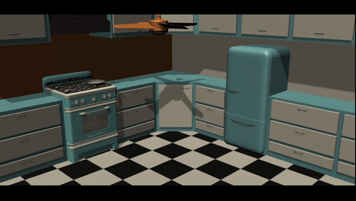

This was a pretty simple process. It took me awhile to find free objects to use, but I ultimately only found the fridge, fan, and stove. The counters are actually basic unity 3d cubes, as well as the cabinets and drawers. I duplicated the handle object on the fridge and created basic color materials to color the counters. 