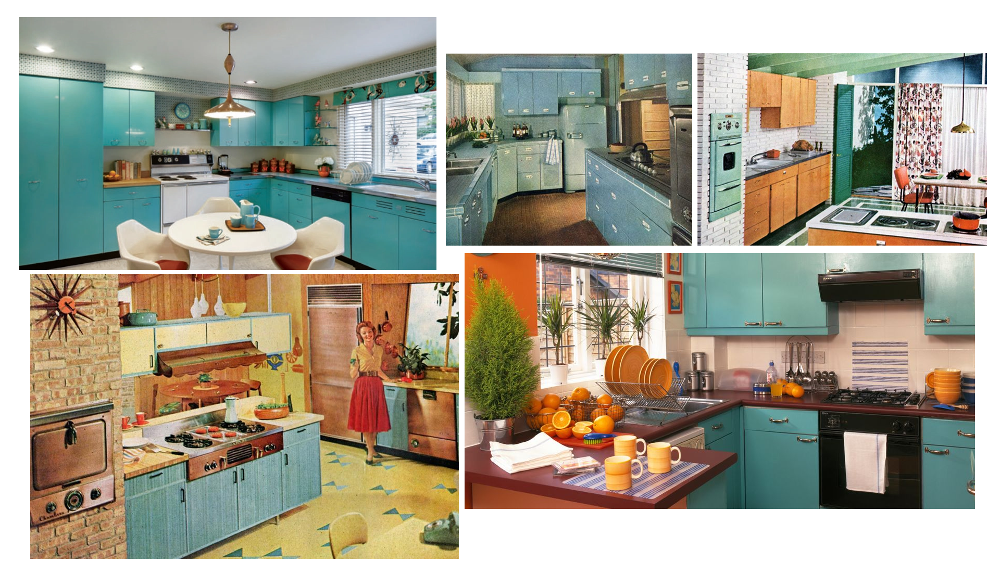
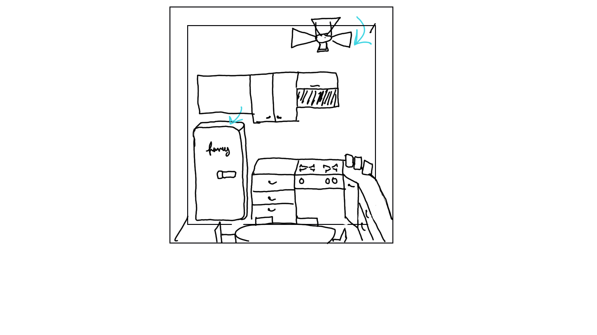

I've decided to combine my pcomp project with this project for animation. Since I am working with an etch-a-sketch, I thought working with a fifties style theme would be iconic for the era. So, I was looking at 50's style kitchens.

Next was drawing out a quick sketch for what I am animating.
