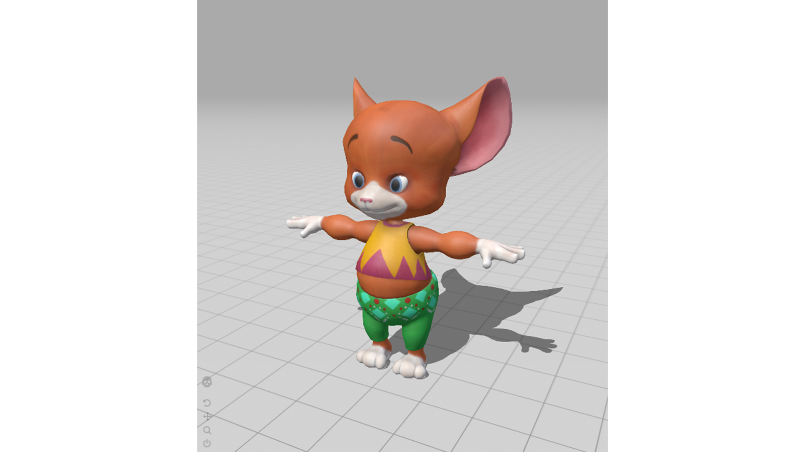

# project description
a series of tiktoks creating cursed mocap models dancing to the beat of blessed / cursed music. 

# inspiration
i was given a tutorial by a classmate (viola he [@bodies.moving](https://www.instagram.com/bodies.moving/)) from their mocap exploration throughout their 100 days.

# plan of action
starting thursday 3/18 posting 1 tiktok a day until monday 3/22. this might be overambitious, but learning mocap and making bad 60 second videos seems like an interesting experience to say the least. 

[here](https://www.youtube.com/watch?v=xDhbfGvtA8w&t=2255s) is a tutorial that has proven to be beneficial

# images
a brief perusal of [mixamo](https://www.mixamo.com/#/?page=1&type=Character) taught me that anything is possible and i can use these models and rig them up to my own cursed purposes. 

this particular little guy is drawing my interest:
