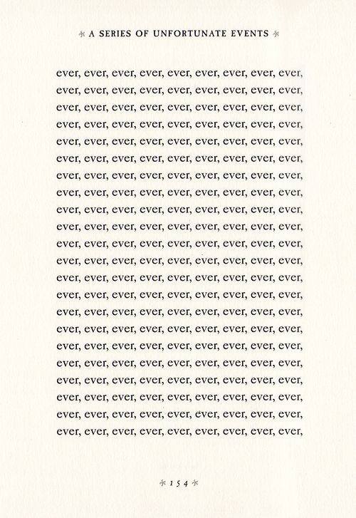
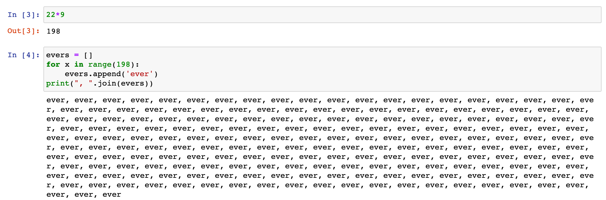
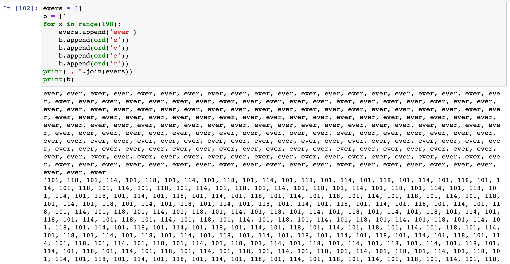
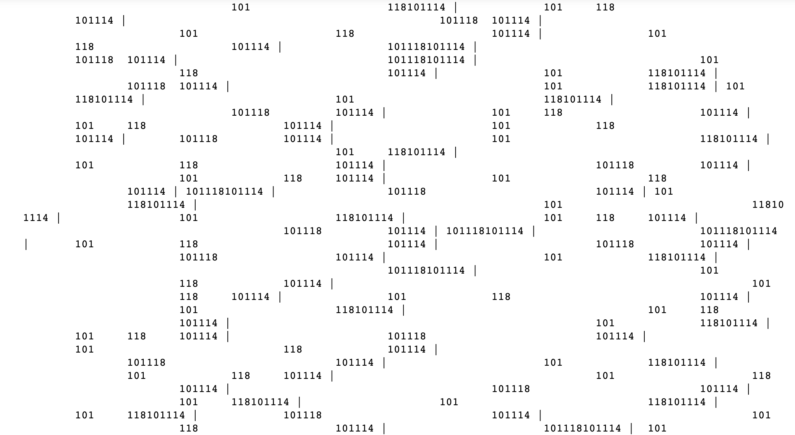

[assignment github](https://github.com/theheckle/mol/blob/master/ever.ipynb)

# Letters and Numbers in Python

When thinking about this assignment, I immediately thought of a distinct page from my childhood. In one of Lemony Snicket's *Series of Unfortunate Events* novels there was an entire page filled with 'ever'.

First I counted how many evers on the page, and decided to do some basic printing to get the hang of python

From there I was experimenting with the unicode representation of the individual characters.

Each character has a number representation:

    e = 101
    v = 118
    e = 101
    r = 118

Since this was my first time playing around with python in this context, I fiddled with some graphs and printing without using new lines `print(char, end=' | ')`

My final composition was messing with loops and utilizing randomly generated tabs throughout. 

I hope to make work that is less pseudo-random and more "noise"-like, utilizing algorithms related to Perlin Noise.