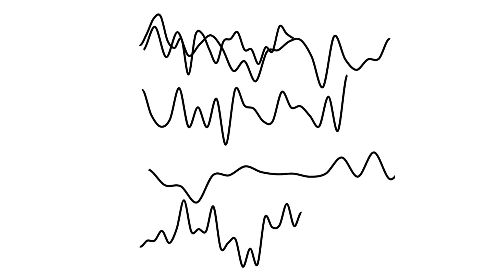
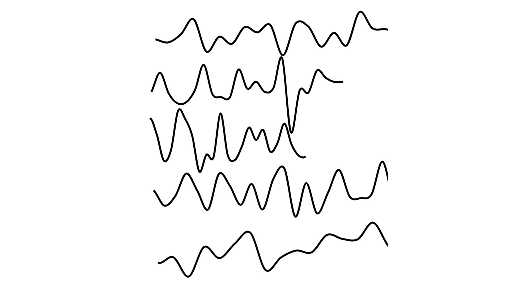
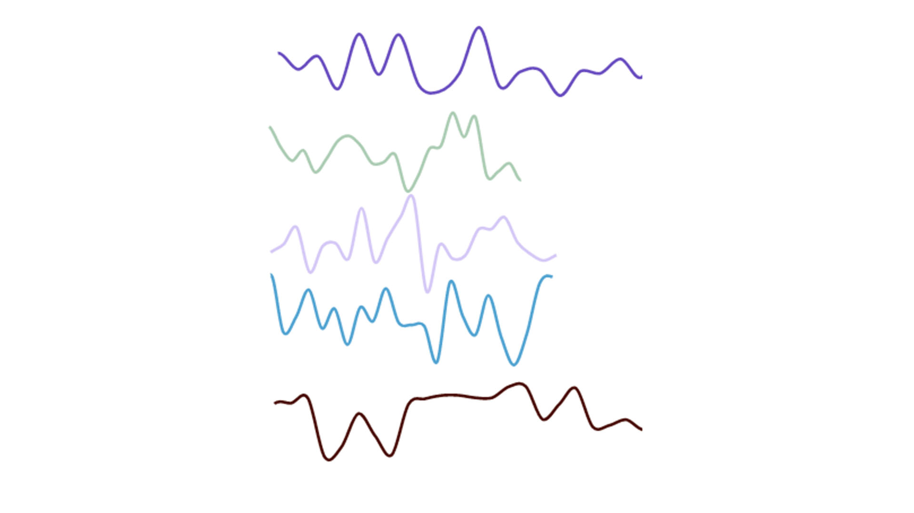

[assignment github](https://github.com/theheckle/mol/blob/master/asemic%20exploration.ipynb)

# Experimenting with Scribbles

# Fixing Experiments in Scribbles

Which is reminiscent of some diviniation I had done with eggs! Check it out [here](http://samheckle.com/blog/blessed/assignment-1/)
