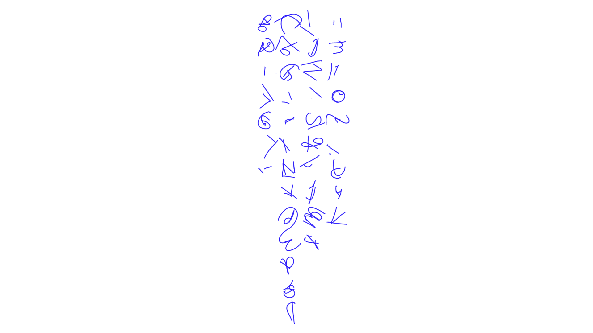
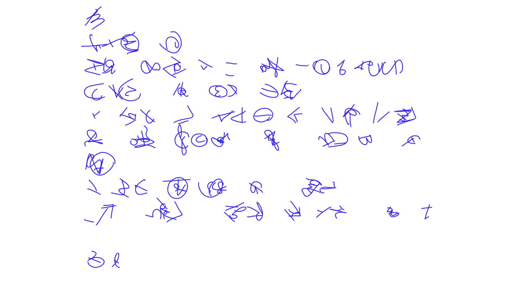
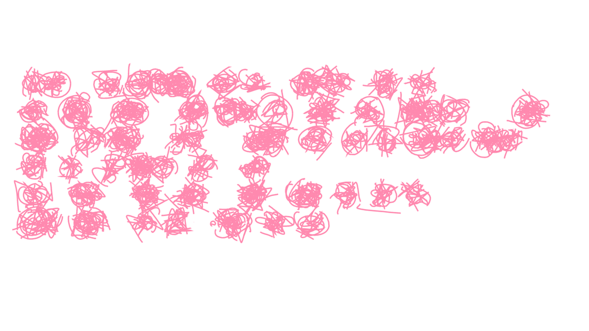
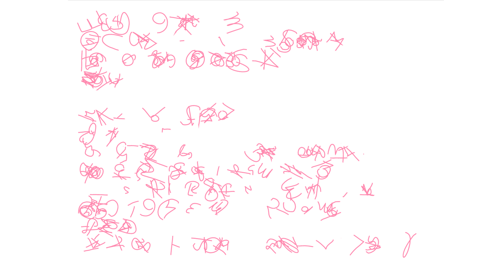
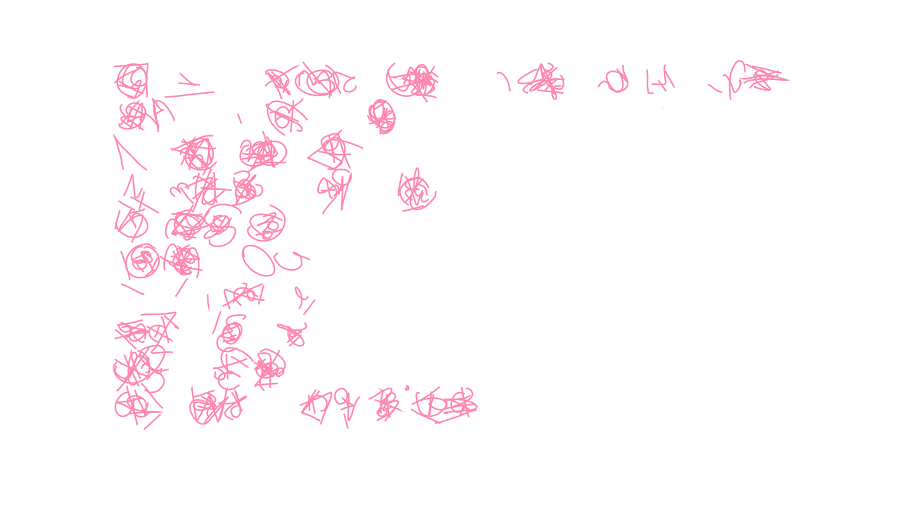

[assignment github](https://github.com/theheckle/mol/blob/master/asemic%20exploration.ipynb)

# More Experiments with Scribbles
For this assignment I was looking into more handwriting and fiddled with some of the sample code:

# Refining the Letters

