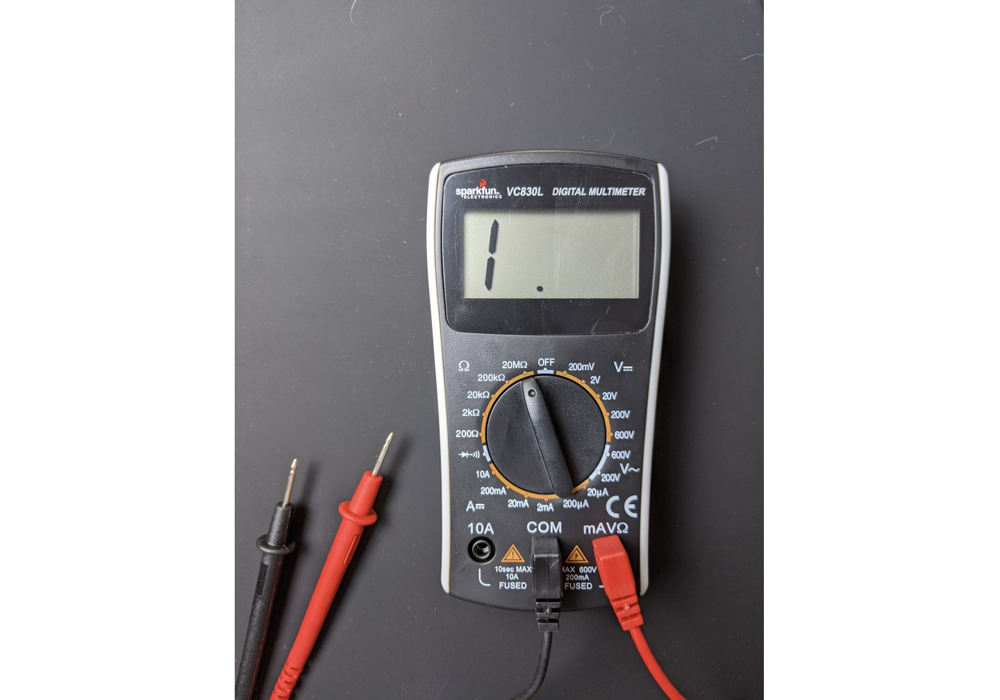
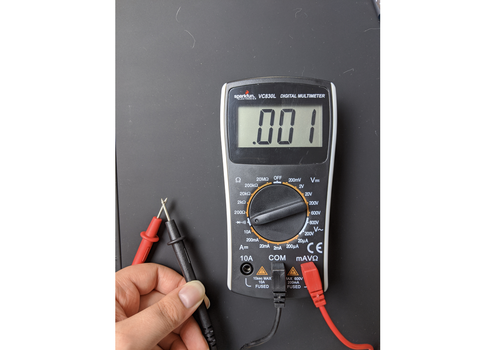
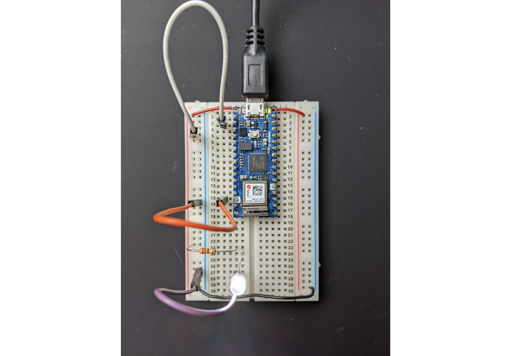
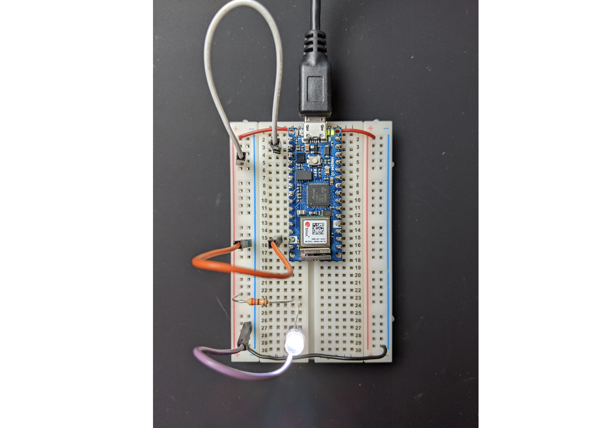
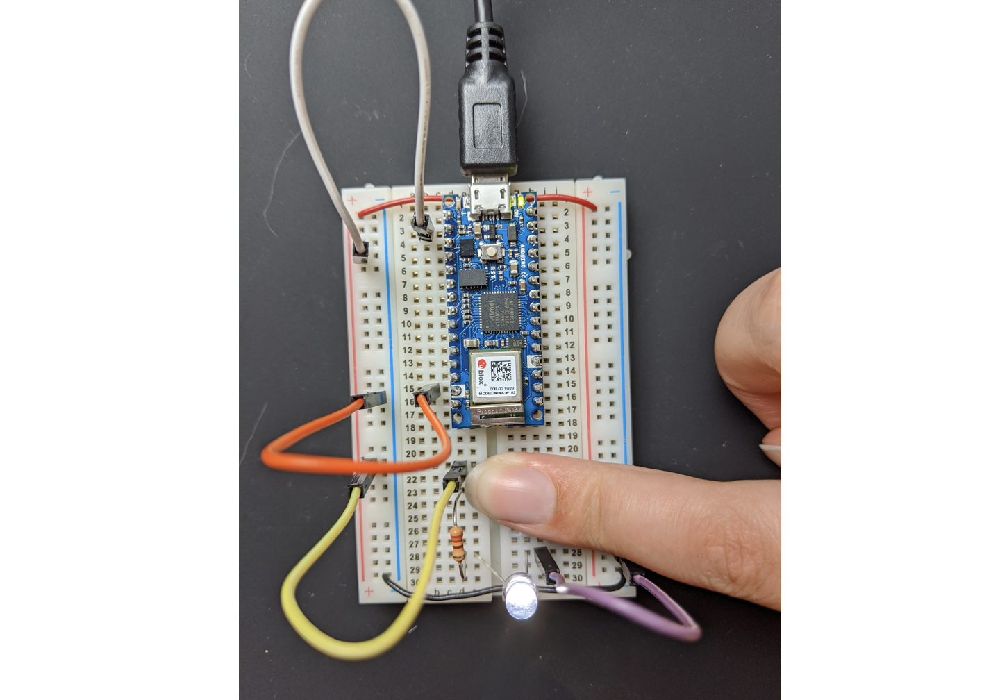
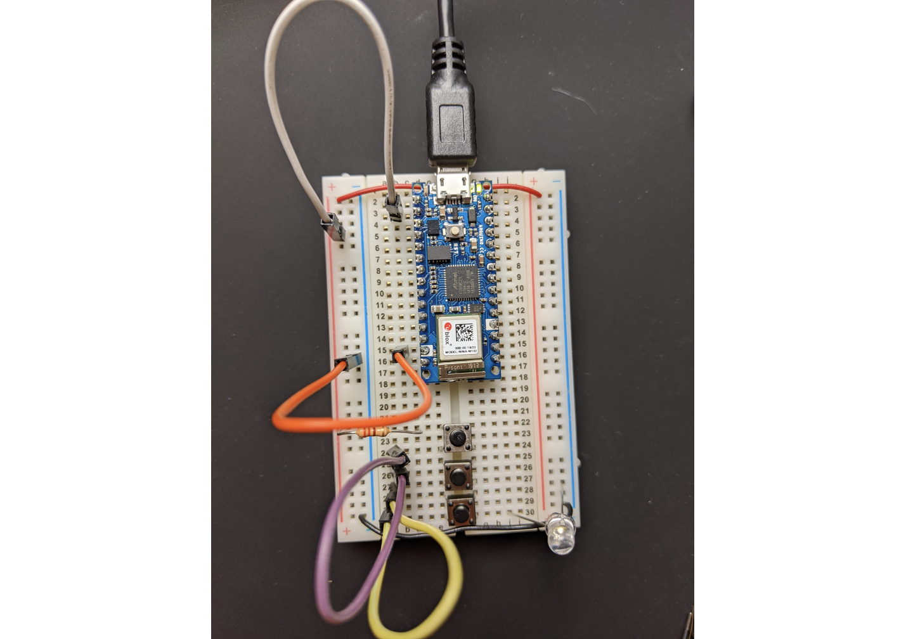
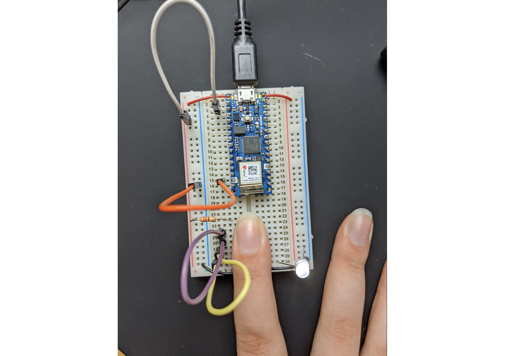
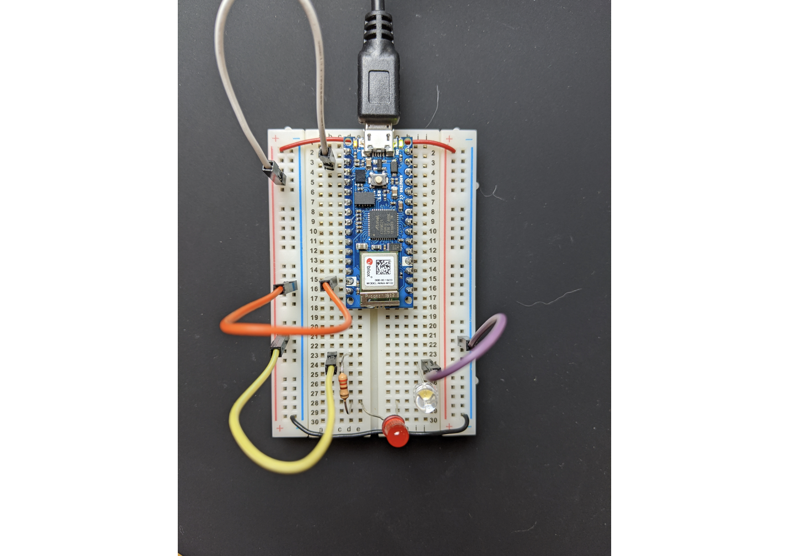
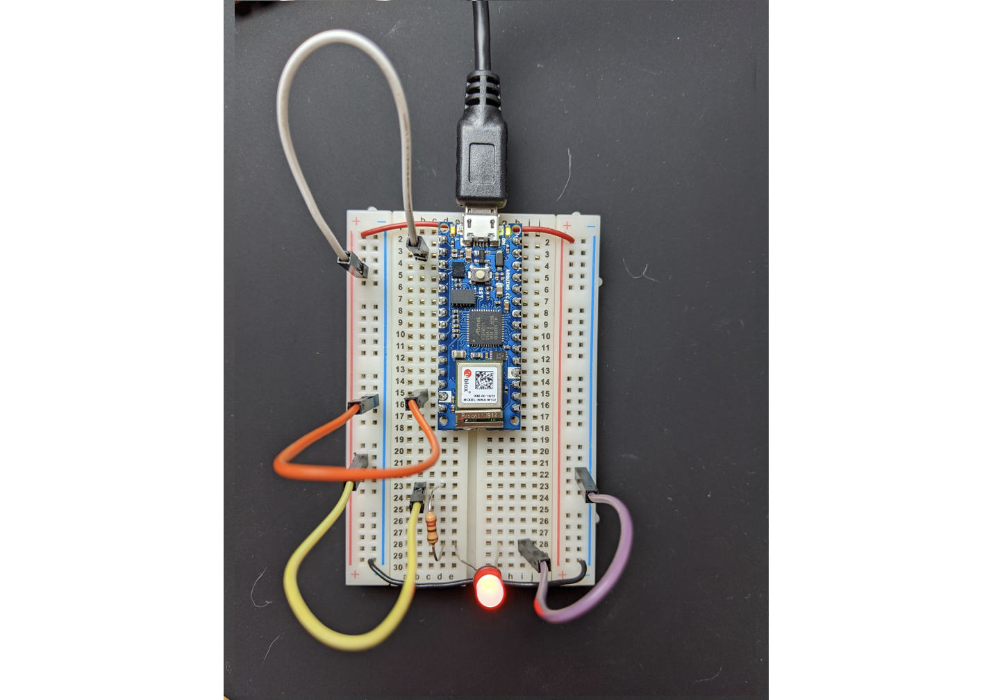
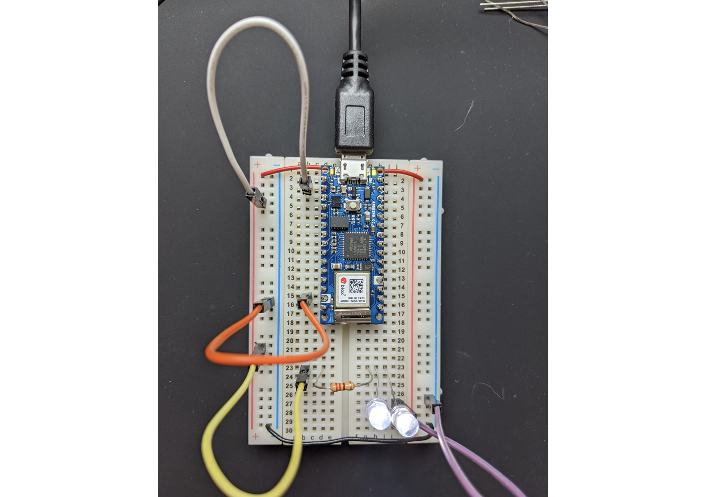

This is a blog post in a response to the first week assignment. 

In regards to the [first lab](https://itp.nyu.edu/physcomp/labs/components/), there isn't to much to say for me. I clarified what a voltage regular is (and how it works best in low voltage ranges). Since I already have a little experience with physical computing, I jumped straight into analyzing the circuits on the breadboard example.

Looking at images of labs:

1. Yes it will light up
2. No it will not light up — the two sides of the bread board are not connected.
3. Yes it will light up — the red wire in the middle connects the two sides of the breadboard.

The [second lab](https://itp.nyu.edu/physcomp/labs/electronics/) focused primarily about electronics.

Photos for testing the meter

Audibly say "yay" when light up — wasn't sure which pin to use on nano

voltage issues with using arduino as power source and having 2 leds in series, don't have dc power adaptor and

The [third lab](https://itp.nyu.edu/physcomp/labs/switches/)

