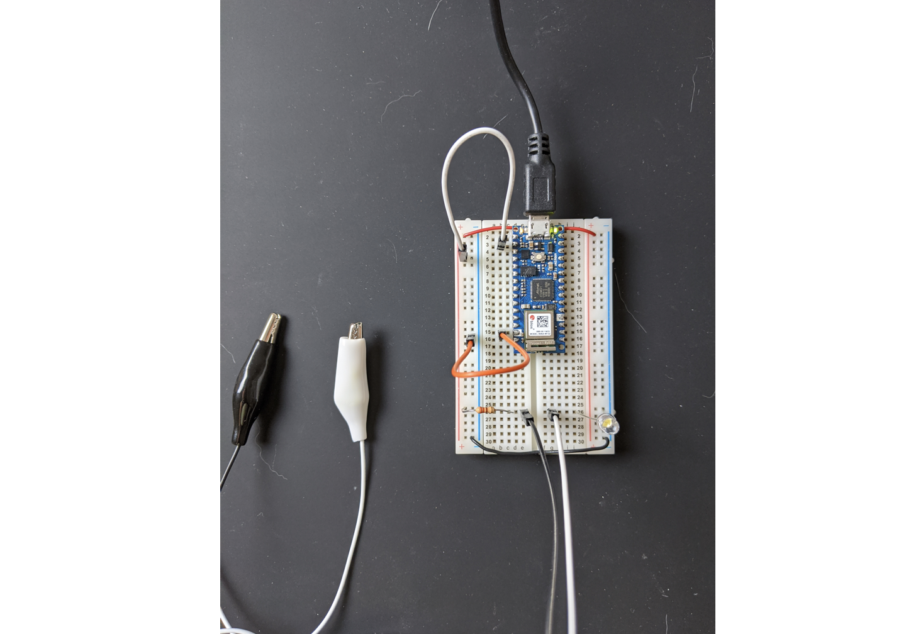
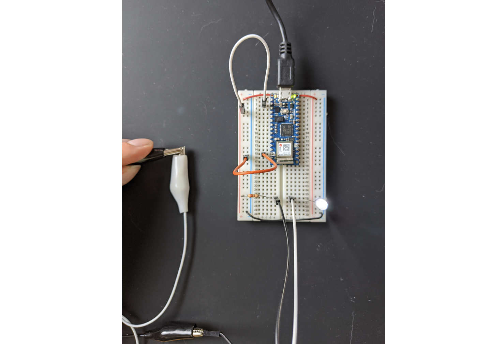
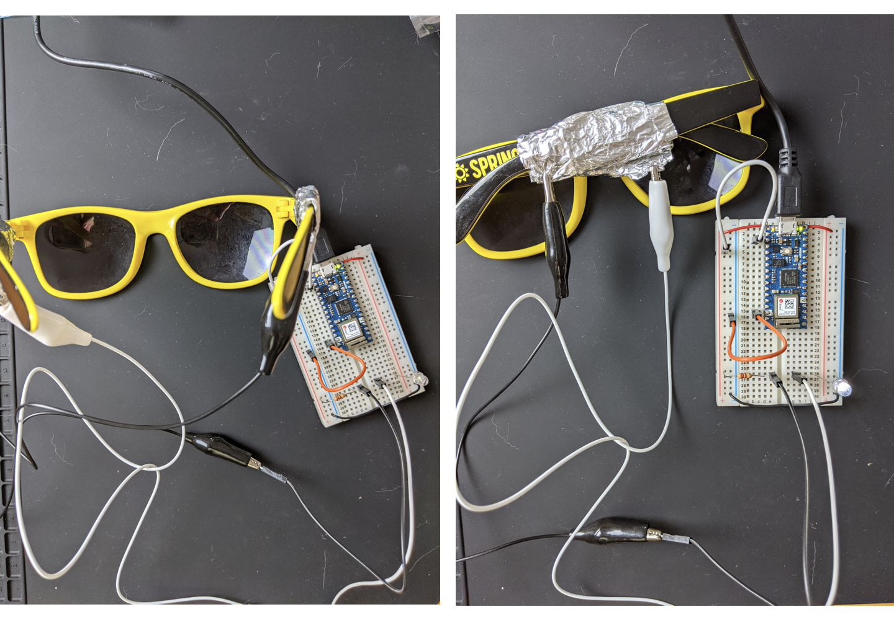
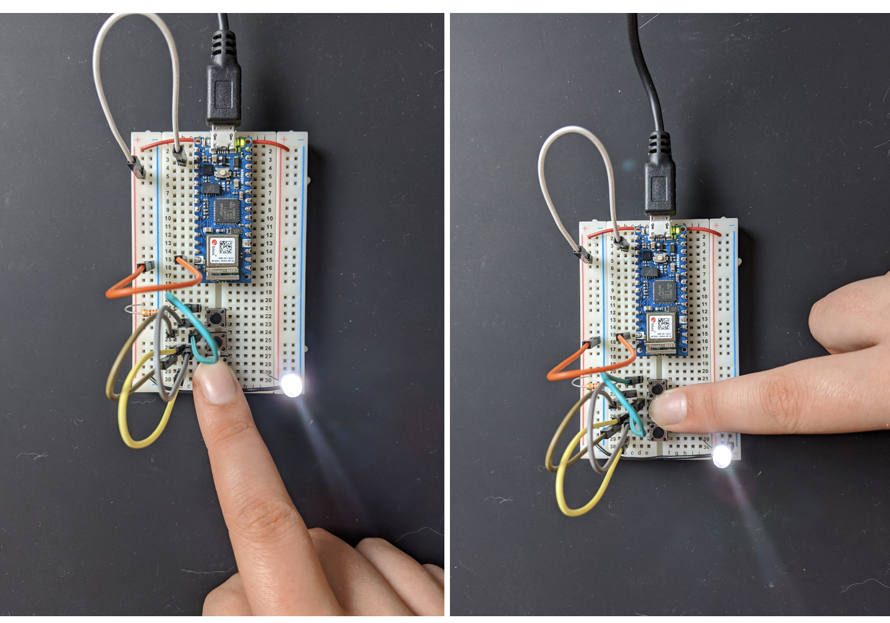

This is a blog post in a response to the first week assignment. 

## First Lab

In regards to the [first lab](https://itp.nyu.edu/physcomp/labs/components/), there isn't to much to say for me. I clarified what a voltage regular is (and how it works best in low voltage ranges). Since I already have a little experience with physical computing, I jumped straight into analyzing the circuits on the breadboard example.

Looking at images of labs:

1. Yes it will light up
2. No it will not light up — the two sides of the bread board are not connected.
3. Yes it will light up — the red wire in the middle connects the two sides of the breadboard.

## Second Lab

The [second lab](https://itp.nyu.edu/physcomp/labs/electronics/) focused primarily about electronics.

Initially it took me a minute to get the hang of the multimeter. Someone had told me previously that this particular one wasn't very good, and I didn't realize what they meant at first. But, it feels made out of cheap plastic and the dial is a bit clunky.

At first, I was following the tutorial but wasn't sure where the baseline was. I tried multiple different settings to find "1". When I touched the probes together I kept getting weird numbers that weren't useful to me following the guide.

After reading the blog post further (and inspecting the manuel 🙈) I figured out this weird icon that makes a sound when you are testing each probe, so huzzah it worked!

# First Circuit with Light

I didn't really know which pins to use on the arduino at first -- I was looking at the image of the breadboard and trying to figure out by counting the number of pins in the image. I had worked with different microcontrollers before, but none as small as the nano and they also all had labels for all the pins. But! I did get the light working after the pin nonsense and audibly said "yay!" so that felt good.

# First Button

Wasn't too bad, I got it set up pretty quickly. You may notice as I go, I am optimizing my wires to use less of the messy jumper cables.

And now it is on! Nice!

Now here is the only place I ran into issues. I didn't realize there would be a problem getting 2 LEDS lit with using the arduino in a series. This is possible with a power adaptor, which I do not have yet. 

# LEDs in a Series

Above is my series not working. I tried two white LEDs, two red, and a red and a white. Not that it made any difference mathmatically, but I was experimenting. I figured out earlier that each LED uses ~2V of power. If the arduino outputs 3.3V, then 3.3V - 2V = 1.3V leftover. 1.3V < 2V, thus unable to power one LED. Another mathmatical solution is to divide 3.3V / 2V = 1.65. We could power 1.65 LEDs using the 3.3V arduino. 2 LEDs require at least 4V of power, which the arduino cannot provide. I cut my losses.

(double checking my red LED works).

I was, however, able to get the parallel circuit working.

# Potentiometer

 

This one was cool and I got it working pretty quicky!

## Third Lab

Lastly the [third lab](https://itp.nyu.edu/physcomp/labs/switches/). 

# Getting Creative With Switches

For my idea to create a custom switch, I used a pair of sunglasses. My circuit was pretty simple --

Above is effectively what my custom switch is. The black and white wires operate as a break in the circuit so that when they touch...

It lights! So theoretically I can use anything to connect these two things. I tried using a pair of sunglasses...

And it lights as well!! I also had a pair of metal sunglasses to try, but the metal was not conductive (which is fair from a design perspective, don't want conductive metal near my face).

# A Series of Buttons. 

And all lit up! Cool. Not much to say here since it was building on top of the previous lab.

# Parallel Buttons

I also tried the parallel buttons and had the same results. It did require a little refactoring of the breadboard because using jumper cables is a bit messy, and this is a reminder to myself to buy some wire before the next project.

I should probably also invest in a bigger breadboard now that I'm thinking about it....

# Switching a Motor

Since I did not have a DC motor at the time of this blog, I was looking at other alternatives. I wanted to try using a servo motor, but to be frank I did not want to mess with some pin nonsense in arduino code. So, I read through the lab and will nestle in my brain that I can turn the motor on with a switch and a LED at the same time.