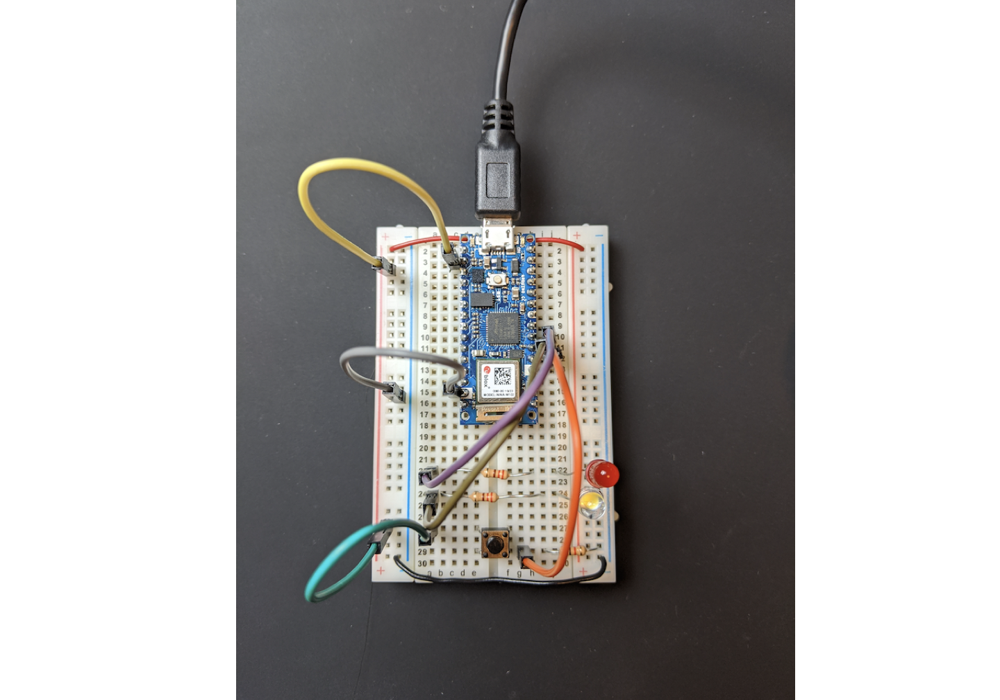
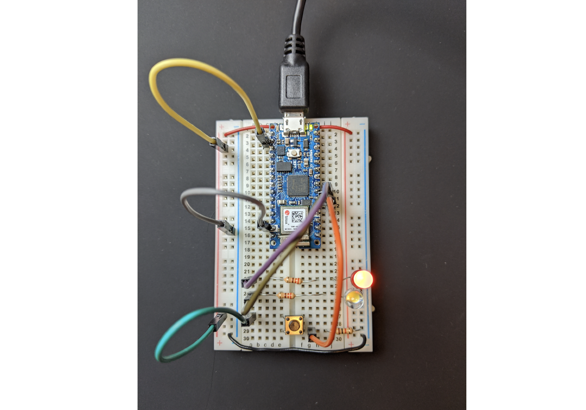
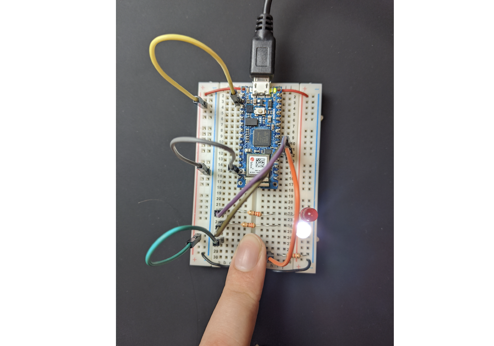
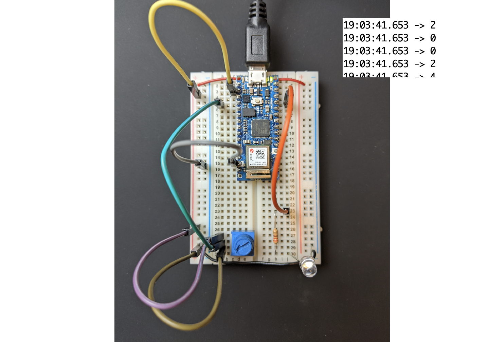
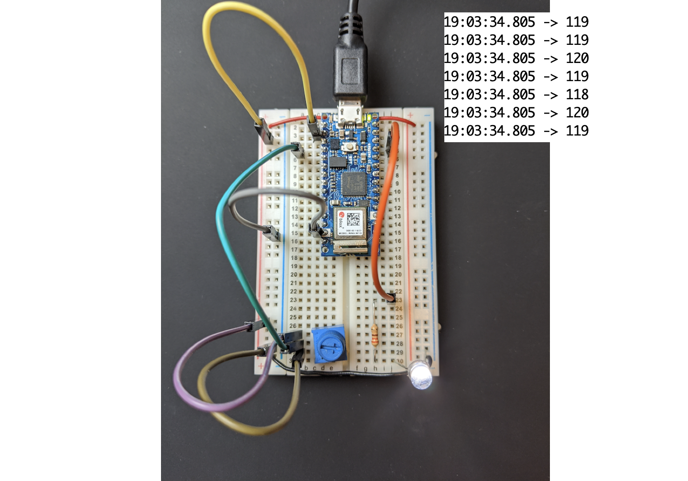
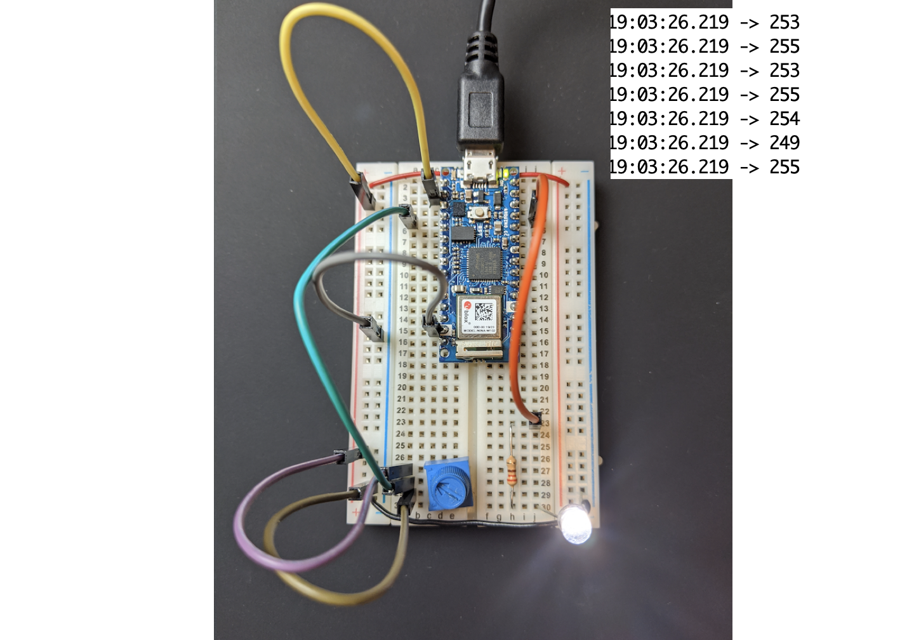
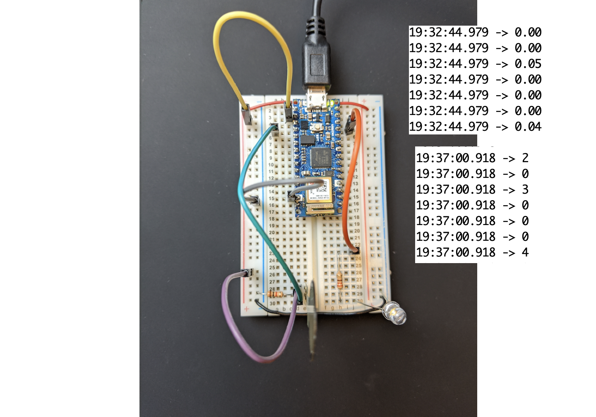
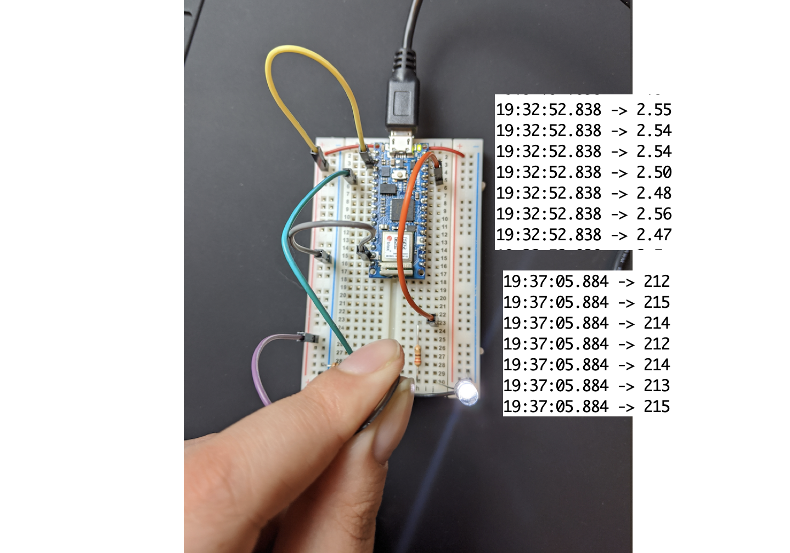

This is a blog post in a response to the third week assignment. 

## Analog Output and Input

[Lab 1](https://itp.nyu.edu/physcomp/labs/labs-arduino-digital-and-analog/digital-input-and-output-with-an-arduino/) was all about setting the stage for analog inputs.

# Analog Input

I first started with a standard button analog input. This was pretty straightforward. I also started dabbling in using my wirecutters to make my resistors flush with the board. I did end up ordering some wire to replace my jumper cables, and I'm looking forward to have a cleaner board!

# Programming the Arduino

For this next part, I created a simple circuit using a button and two LEDs.

I did not have any issues with setting the Arduino IDE for this lab. I easily was able to upload and test with the nano. This was my code for the first part of the lab:

    void setup() {
        // put your setup code here, to run once:
        pinMode(2, INPUT);
        pinMode(3, OUTPUT);
        pinMode(4, OUTPUT);
    }

    void loop() {
        // put your main code here, to run repeatedly:
        if (digitalRead(2) == HIGH){
            digitalWrite(3, HIGH);
            digitalWrite(4, LOW);
        }
        else{
            digitalWrite(3, LOW);
            digitalWrite(4, HIGH);
        }
    }

With the resulting circuit:

## Digital Input and Output

The [second lab](https://itp.nyu.edu/physcomp/labs/labs-arduino-digital-and-analog/analog-in-with-an-arduino/) focused on digital input, meaning the input can have a spectrum and decimal values. I equate digital input like a "double" in programming.

# Potentiometer and LED

The first part of this exercise was using a potentiometer. In the code below, I print out the corresponding voltage for each measurement of the pontentiometer. There isn't too much of a difference in the photos between halfway (120) and full (255) brightness, but in person it was clear.

    const int ledPin = 9;
    int analogValue = 0;
    int brightness = 0;

    void setup() {
        // put your setup code here, to run once:
        Serial.begin(9600);
        pinMode(ledPin, OUTPUT);
    }

    void loop() {
        // put your main code here, to run repeatedly:
        analogValue = analogRead(A0);
        brightness = analogValue / 4;
        analogWrite(ledPin, brightness);
        Serial.println(brightness);
    }

# Force-Sensing Resistors (FSR)

I had two parts to this:

#### Part 1 - Printing the Voltage
In the below code I printed the voltage for the pressure sensor. 

    void loop() {
        // put your main code here, to run repeatedly:
        int sensorValue = analogRead(A0);
        
        float voltage = sensorValue * (5.0 / 1023.0);
        Serial.println(voltage);

        analogWrite(9, brightness);
    }

#### Part 2 - Printing the Brightness with Mapping
In the below code I printed the brightness, after mapping it to the corresponding values. I found the min and max by experimenting with the FSR and printing out the plain sensor value before trying to map it. 

    void loop() {
        // put your main code here, to run repeatedly:
        int sensorValue = analogRead(A0);
        
        int brightness = map(sensorValue, 0, 700, 0, 255);
        Serial.println(brightness);

        analogWrite(9, brightness);
    }

And that's that!