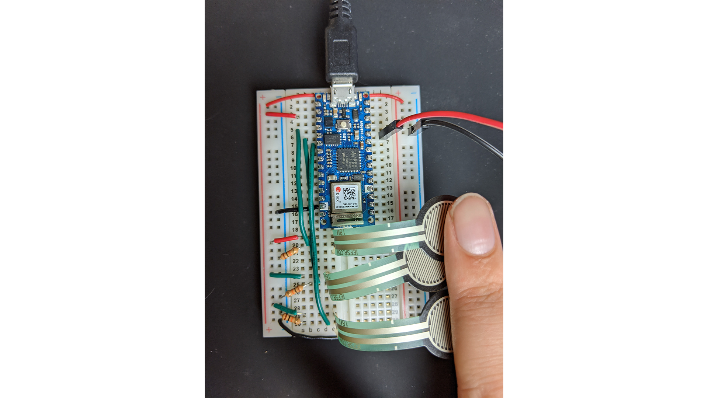

This is a blog post in a response to the fourth week assignment. 

## Tone Output Using An Arduino

[Lab 1](https://itp.nyu.edu/physcomp/labs/labs-arduino-digital-and-analog/tone-output-using-an-arduino/) 

# Connecting the Sensors and the Speaker

`youtube: https://www.youtube.com/watch?v=NxcxCt4jipw`

# A Musical Instrument

`youtube: https://www.youtube.com/watch?v=0vRH2xaw9r0`

## Server Motor Control

[second lab](https://itp.nyu.edu/physcomp/labs/labs-arduino-digital-and-analog/servo-motor-control-with-an-arduino/) 

