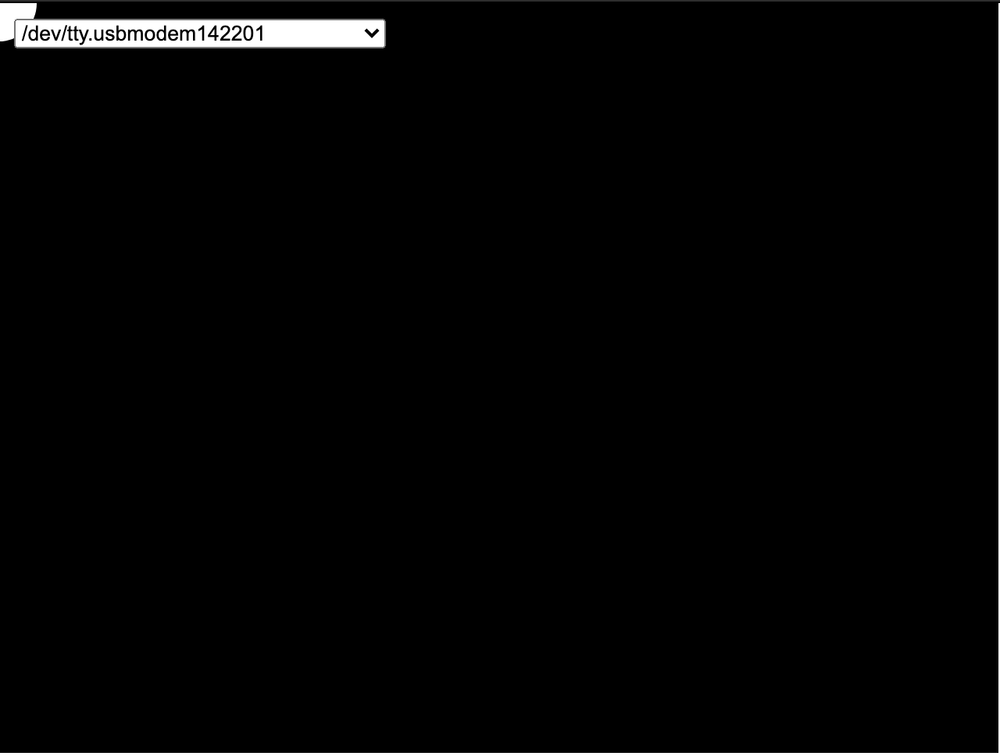

## Two-Way (Duplex) Serial Communication Using An Arduino and P5.js
[lab](https://itp.nyu.edu/physcomp/labs/labs-serial-communication/two-way-duplex-serial-communication-using-p5js/)

This lab was pretty simple to follow but I ran into small errors throughout the way. Since I was using the on board accelerometer I had to modify the startup on the Adrduino:

    void setup() {
        Serial.begin(9600);

        // for on board arduino accelermeter 
        while (!Serial) {
            ; // wait for serial port to connect. Needed for native USB port only
        }
        if (!IMU.begin()) {
            Serial.println("Failed to initialize IMU!");
            while (true); // halt program
        }
        Serial.println("IMU initialized!");

        // configure the digital input:
        pinMode(buttonPin, INPUT_PULLDOWN);

        while (Serial.available() <= 0) {
            Serial.println("hello"); 
            delay(300);              
        }
    }

I also was running into issues connecting to the localhost and it was not connecting.

I don't think I figured this out quite yet. I still had issues that I had yet to debug and will have questions in class about. 

[here](https://docs.google.com/forms/d/e/1FAIpQLSfyf_0SW0tkYssxTkGT7F9ifwIdruQQ50jhac1dHqLOXU-aUg/viewform?edit2=2_ABaOnufbfCNNEvpx_6I1Yzj9KdsOQGibS9YaBqfwQNSHIrXczANQvs04ai4Fg3LuX56yoIs) is my quiz from the week.