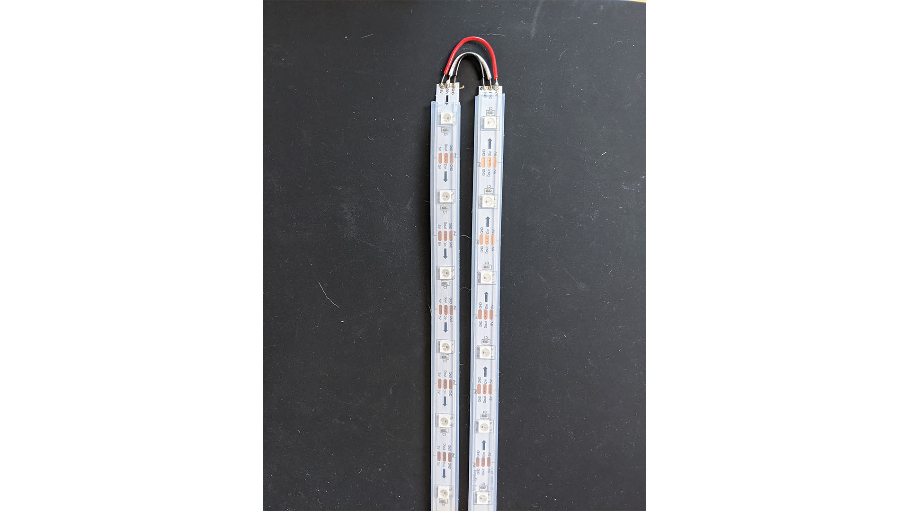
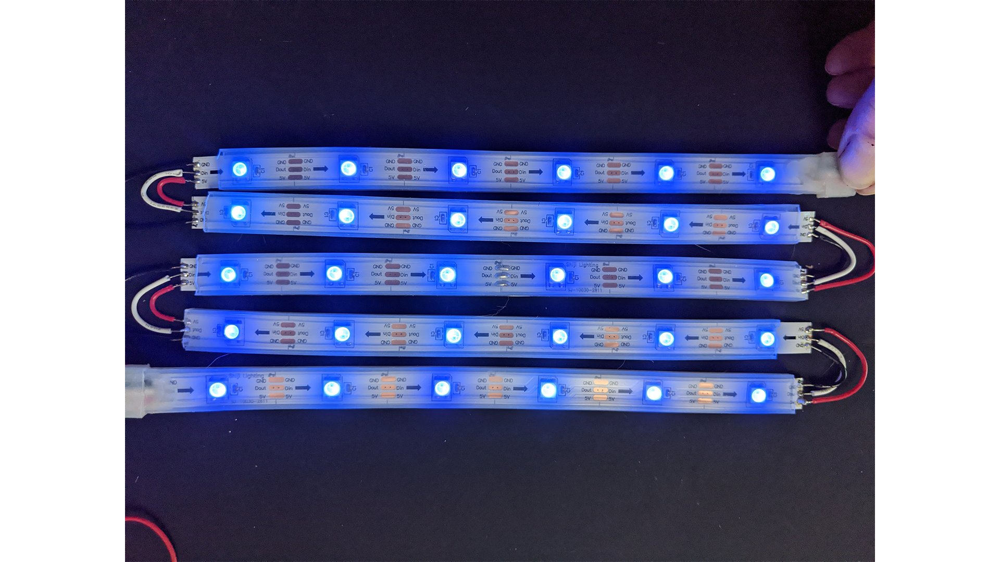
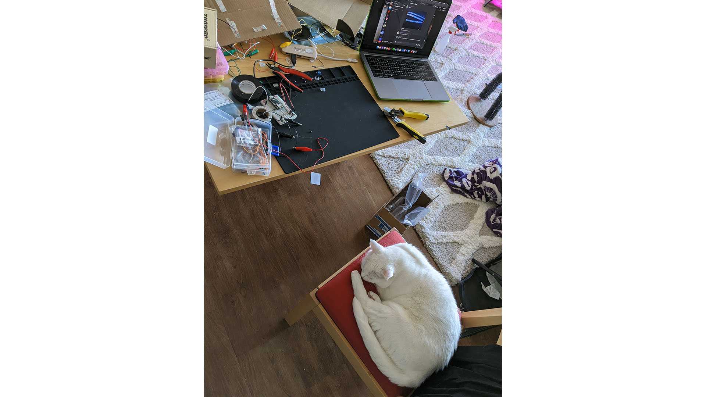
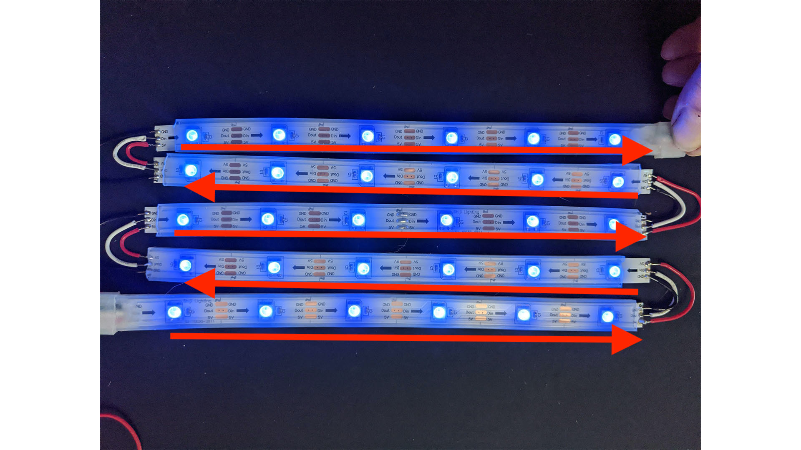
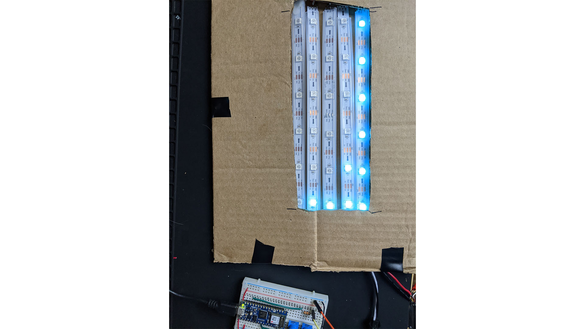
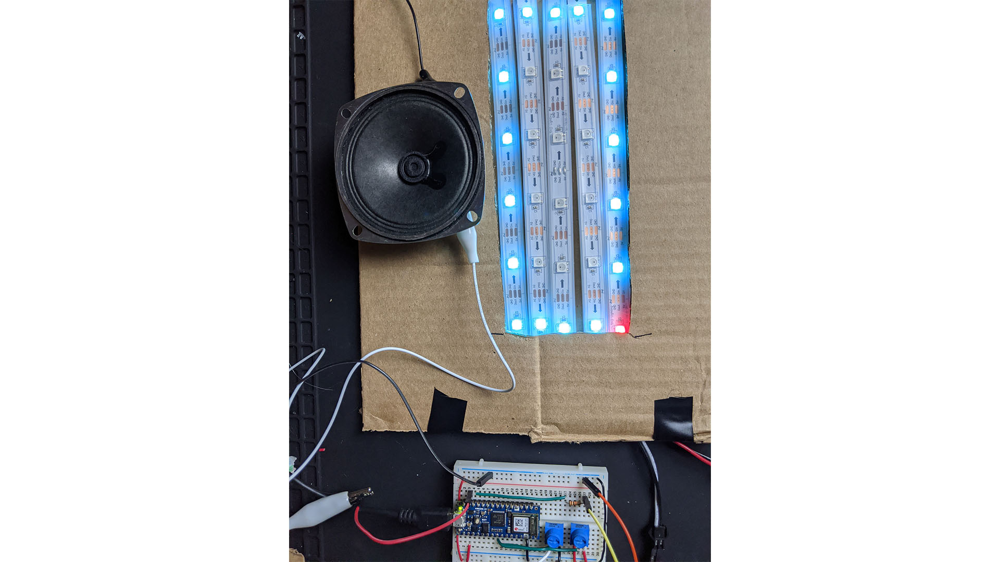

## Project 1 

A big issue I ran into this project was waiting for parts to arrive. I ran with the suggestion to acquire neopixels to make a grid. I ended up buying the wrong ones (a strip instead of a matrix), so I had to cut and re-solder to make a flexible grid.

# Hardware

This was my first attempt at a solder (ever!). I think I did ok, and I definitely got better as I went along.

Final soldering result. It is now in the grid shape that I want to use for my etch-a-sketch.

While going back and forth between my stovetop (where I had a vent and can solder in my apartment), my cat took over my work station.

# Software

Next was thinking about the code I wanted to create. I wanted to use two potentiometers as the two etch-a-sketch wheels that move the lines around. 

Using the `Adafruit_NeoPixel` library, you can light up the leds using the neopixel object, like so:

    // constructor with parameters of number of pixels (30), pin number (10)
    Adafruit_NeoPixel strip = Adafruit_NeoPixel(NUMPIXELS, 10);

    // setting the individual led number (1) to specified color
    strip.setPixelColor(1, strip.Color(0, 75, 75));

    // displaying the color
    strip.show(); 

I needed to find a way to store the information of where the light should be lit. The led strip itself keeps track of the leds in order, numbered 0-29. I needed to find a way to create a 2D array to easily keep track of rows and columns, so I created a constant array:

    const int leds[5][6] = 
        {{0,1,2,3,4,5},
        {11,10,9,8,7,6}, 
        {12,13,14,15,16,17}, 
        {23,22,21,20,19,18},
        {24,25,26,27,28,29}};

Notice how these aren't in numerical order. This is because the "grid" of leds flows in one direction.

So, the numbers needed to reflect the grid itself and the order the led is on the strip. Which is how we got two rows that are in reverse order, we have two led strips that are in the opposite direction.

From there, I needed to figure out the best way to move the lights. Since it relied on potentiometers, it could dial between the "rows" and "columns".

    // handling rows
    if(rightSwitch < 1023 / 2 && row > 0){
        row -= 1;
    }
    if(rightSwitch >= 1023 / 2 && row < 4){
        row +=1;
    }

    if(leftSwitch < 1023 / 2 && column > 0){
        column -= 1;
    }
    if(leftSwitch >= 1023 / 2 && column < 5){
        column +=1;
    }

    delay(1000);

Pretty simple logic. It will add and subtract based on the halfway point. This does mean drawing in the middle is challenging, but so is an etch-a-sketch. I also added a delay so the numbers wouldn't change too quickly.

I added a carboard housing to cover up the wires of the led strips, but the arduino wouldn't fit underneath without being crushed. So I left it outside the housing.

Once I got to testing this, I realized I would lose where the led was "resting", like so:

I didn't know where the drawing left off. So I wrote some code using a previous class exercise:

    // find where led is 'resting'
    current = leds[row][column];
    ledTracking[row][column]=1;
    
    strip.setPixelColor(current, strip.Color(0, 75, 75));
    if(current == previous){
        strip.setPixelColor(current, strip.Color(75, 0, 0));
    } else{
        strip.setPixelColor(previous, strip.Color(0, 75, 75));
    }
    previous = current;
    strip.show(); 

Effectively this makes the led red when it is "resting", or when the previous and current state are the same.

Now I know where the led will start drawing from! 

I also added the speaker to play a tune once you made the final shape!!

`youtube: https://youtu.be/35pBfFxisrs`

And here is my final code:

    #include <Adafruit_NeoPixel.h>
    #include "pitches.h"

    #define NUMPIXELS 30 

    Adafruit_NeoPixel strip = Adafruit_NeoPixel(NUMPIXELS, 10);

    const int leds[5][6] = {
        {0,1,2,3,4,5},
        {11,10,9,8,7,6}, 
        {12,13,14,15,16,17}, 
        {23,22,21,20,19,18},
        {24,25,26,27,28,29}};
    int ledTracking[5][6] = {};
    const int speakerPin = 11; 
    int notes[] = {
    NOTE_A4, NOTE_B4, NOTE_C3 };  

    void setup() {
    pinMode(A5, INPUT);
    strip.begin();
    Serial.begin(9600);
    
    strip.clear();
    strip.setPixelColor(1, strip.Color(0, 75, 75));
    strip.show(); 
    }

    int row = 1;
    int column = 1;
    int light = 1;
    int current = 0;
    int previous = 0;

    void loop() {
    
    float rightSwitch = analogRead(A5);
    float leftSwitch = analogRead(A4);

    // handling rows
    if(rightSwitch < 1023 / 2 && row > 0){
        row -= 1;
    }
    if(rightSwitch >= 1023 / 2 && row < 4){
        row +=1;
    }

    if(leftSwitch < 1023 / 2 && column > 0){
        column -= 1;
    }
    if(leftSwitch >= 1023 / 2 && column < 5){
        column +=1;
    }

    delay(1000);

    // find where led is 'resting'
    current = leds[row][column];
    ledTracking[row][column]=1;
    
    strip.setPixelColor(current, strip.Color(0, 75, 75));
    if(current == previous){
        strip.setPixelColor(current, strip.Color(75, 0, 0));
    } else{
        strip.setPixelColor(previous, strip.Color(0, 75, 75));
    }
    previous = current;
    strip.show(); 

    // music based on led shape (square)
    if(ledTracking[0][0] == 1 &&
        ledTracking[0][1] == 1 &&
        ledTracking[0][2] == 1 &&
        ledTracking[0][3] == 1 &&
        ledTracking[0][4] == 1 &&
        ledTracking[0][5] == 1 &&
        ledTracking[1][0] == 1 &&
        ledTracking[2][0] == 1 &&
        ledTracking[3][0] == 1 &&
        ledTracking[4][0] == 1 &&
        ledTracking[1][5] == 1 &&
        ledTracking[2][5] == 1 &&
        ledTracking[3][5] == 1 &&
        ledTracking[4][5] == 1 &&
        ledTracking[4][4] == 1 &&
        ledTracking[4][3] == 1 &&
        ledTracking[4][2] == 1 &&
        ledTracking[4][1] == 1 &&
        ledTracking[4][0] == 1){ 
        tone(speakerPin, notes[0], 20);
        tone(speakerPin, notes[1], 20);
        tone(speakerPin, notes[3], 20);
    }
    }
