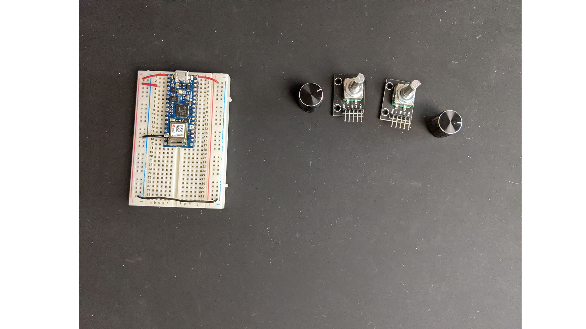
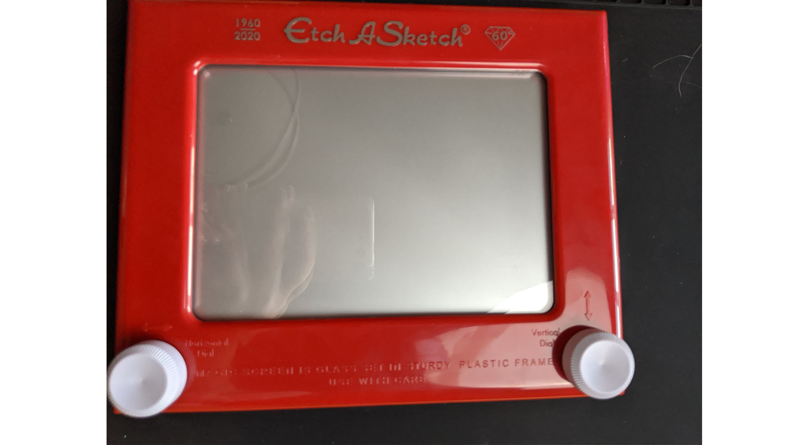
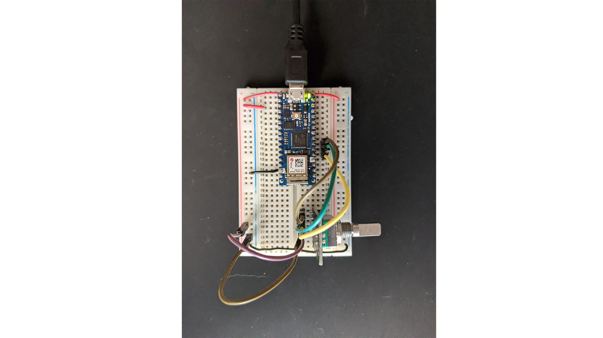
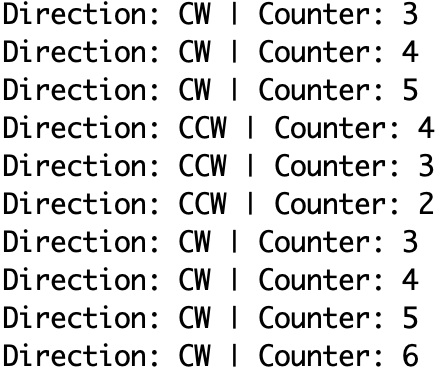
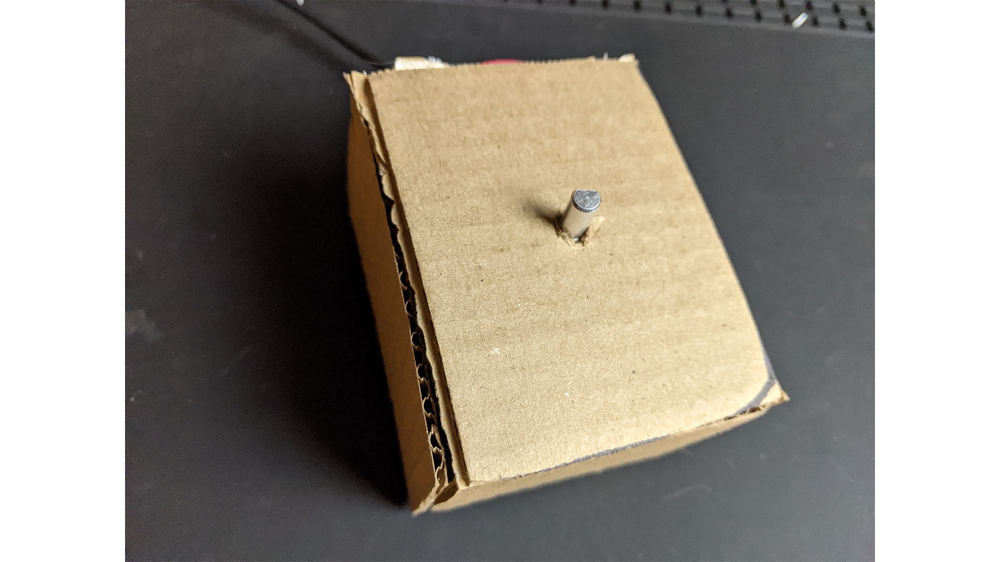
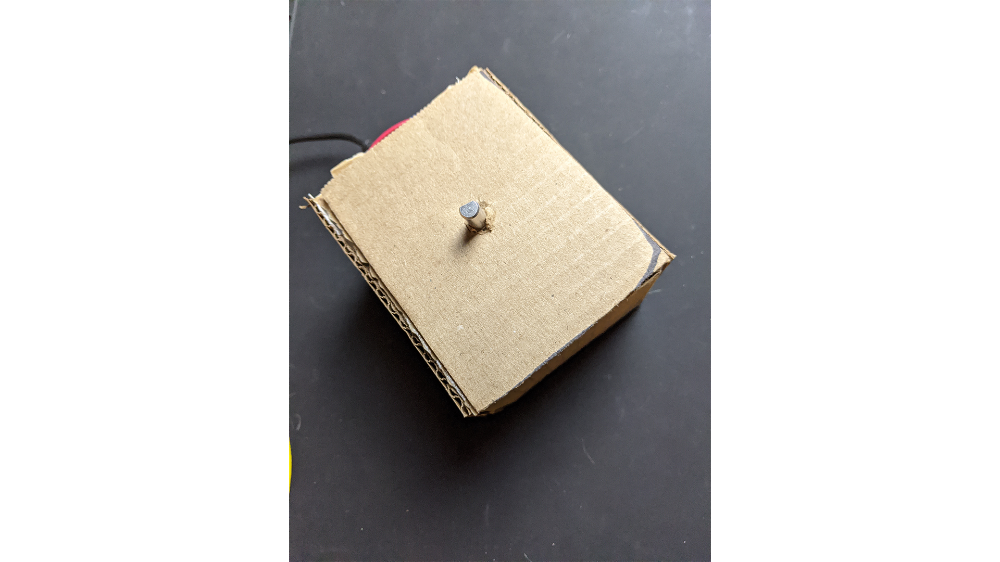

## Project 2 

# New Concepts: Rotary Encoder

I was looking around for rotary encoder tutorials for using one as a part of my etch a sketch.
This was the [initial tutorial](https://bildr.org/2012/08/rotary-encoder-arduino/) I had found but ultimately followed [this](https://bit.ly/3nakt49) when my parts arrived.

Fundamentally, I am working with two rotary encoders and my on board accelerometer.

I also had an etch-a-sketch on hand, but unfortunately to take it apart I would need a Dremel saw and I could not access one.

So I opted to make do with what I had and make a small controller.

From there I wired up a prototype to make sure the encoders worked.

And included this code:

    #define CLK 4
    #define DT 3
    #define SW 2

    int counter = 0;
    int currentStateCLK;
    int lastStateCLK;
    String currentDir ="";
    unsigned long lastButtonPress = 0;

    void setup() {
    
        // Set encoder pins as inputs
        pinMode(CLK,INPUT);
        pinMode(DT,INPUT);
        pinMode(SW, INPUT_PULLUP);

        // Setup Serial Monitor
        Serial.begin(9600);

        // Read the initial state of CLK
        lastStateCLK = digitalRead(CLK);
    }

    void loop() {
    
        currentStateCLK = digitalRead(CLK);
        if (currentStateCLK != lastStateCLK  && currentStateCLK == 1){
            if (digitalRead(DT) != currentStateCLK) {
            counter --;
            currentDir ="CCW";
            } else {
            // Encoder is rotating CW so increment
            counter ++;
            currentDir ="CW";
            }

            Serial.print("Direction: ");
            Serial.print(currentDir);
            Serial.print(" | Counter: ");
            Serial.println(counter);
        }

        lastStateCLK = currentStateCLK;

        delay(1);
    }

This code produced the below output when turning the rotary switch:

Next up was soldering my rotary encoders so they did not require to be directly in the breadboard. 

After soldering I worked on my code for the serial aspect. I made a tiny shoot-em-up to play around with some p5 code. I dove into the `noise()` function a little bit when trying to create a randomly set of moving enemies. 

Finally it came time to assemble the housing and replace the assets.

Ultimately I used 1 rotary encoder, some cardboard, and the onboard accelerometer for this project. The rotary encoder controls the x movement, and the accelerometer controlls the y movement.

`youtube: https://youtu.be/bX9I5RFTtDc`

And here is my final [p5 sketch](https://editor.p5js.org/samheckle/sketches/OVaTVeUzk).