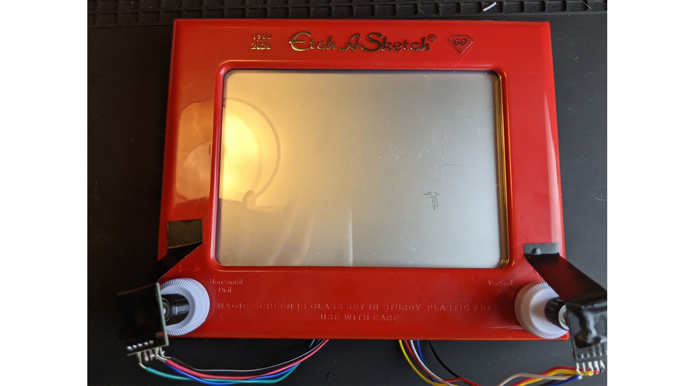

## Project 3 Original Goals

Original goals for this upgraded version:

❌ upgraded housing with etch-a-sketch using a circular dremel saw
✅ modify the controller to look clean on the housing and solder wires
✅ add second rotary encoder
✅ upgrade game with updated animations to combine with my animation classwork

## Animation

For my [animation part](http://samheckle.com/blog/animation/unity-animation/), I wrote up how I actually designed the animation in unity. Here it is without any of the controls.

## Process

I struggled a little bit to get the serial to work with unity. I followed a fellow student's [documentation](https://www.notion.so/For-2nd-Project-cd993e5cab6b4975aecb10d782c22267) about getting unity to work with my following additions in the script:

    void OnDataReceived (string message) {
        try {
            // fan rotation on y axis
            if(message.IndexOf("W") == 13){
                float y = fanAnimator.transform.rotation.y;
                y += 10;
                fanAnimator.transform.Rotate(
                    fanAnimator.transform.rotation.x, 
                    y, 
                    fanAnimator.transform.rotation.z, Space.Self);
            } else if (message.IndexOf("W") == 12) {
                float y = fanAnimator.transform.rotation.y;
                y -= 10;
                fanAnimator.transform.Rotate(
                    fanAnimator.transform.rotation.x, 
                    y, 
                    fanAnimator.transform.rotation.z, Space.Self);
            } 
            
            // pan animation
            else if(message.IndexOf("m") == 0){
                Debug.Log("pan animating");
                panAnimator.enabled = true;
                panAnimator.Play("pan animation", -1, 0f);
            } 
            
            // drawer movement on z axis
            else if(message.IndexOf("I") == 13){
                float z = drawerAnimator.transform.position.z;
                if(z <= minZ){
                    z += .5f;
                }
                drawerAnimator.transform.position = new Vector3(
                    drawerAnimator.transform.position.x, 
                    drawerAnimator.transform.position.y, 
                    z);
            } else if(message.IndexOf("I") == 12){
                float z = drawerAnimator.transform.position.z;
                z -= .5f;
                drawerAnimator.transform.position = new Vector3(
                    drawerAnimator.transform.position.x, 
                    drawerAnimator.transform.position.y, 
                    z);
            }
        } catch (System.Exception e) {
            Debug.LogWarning (e.Message);
        }
    }

I functionally had the same code as the last time for the arduino, the only difference is adding the second rotary encoder. 
I will link my previous project [here](http://samheckle.com/blog/physical-computing/project-2/) for reference.

These were for parsing the string coming in from the arduino. 

Next I wired up my breadboard:

and I attached the rotary encoders to the etch-a-sketch:

and I was able to get the drawer, fan, and pan moving on screen with the encoders!

It's a bit awkward due to how the rotaries are attached to the etch-a-sketch (glued and taped on). The left one operates the drawer and the right one operates the ceiling fan. Shaking the etch-a-sketch makes the pan move!

Overall I had fun with this project seeing it grow and if I were to take it further I would have bought several back up etch-a-sketches and refined the housing even further.