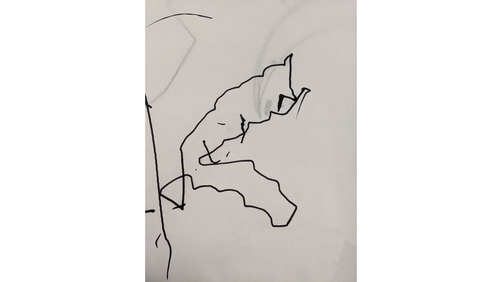
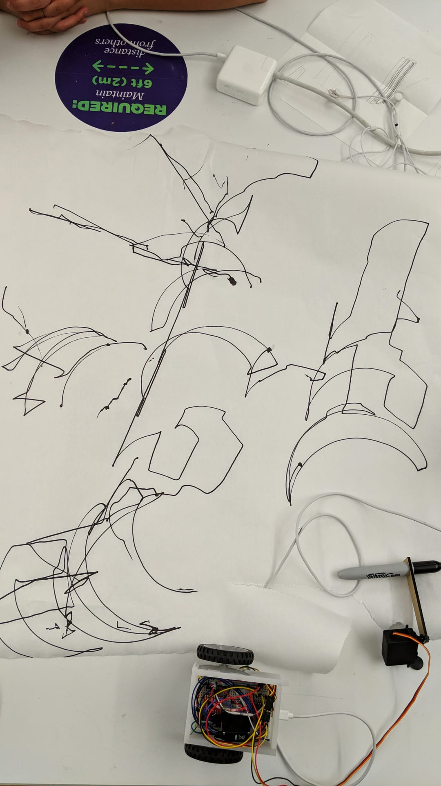

## Idea

For my final, I am combining my classes of Material of Language, Blessed/Blursed/Cursed, and Religious Robots. 

I intend to create a robot that has 3 parts:

# Part 1

Mechanical Arm shaped in a hand holding pen or pencil

- arm goes up, down, left, right

# Part 2

Digital component that draws fake bible verses 

- Manages text that is being drawn

# Flow

The robot begins the experience with the user replacing the paper and pushing a button. The bot will write asemically from the bible. The experience ends with the pen being lifted up.

- Stretch goal #1 - spread salt circle after button push to protect
- Stretch goal #2 - have the bot push the pen around the circle breaking it

## Work So Far

`youtube: https://www.youtube.com/watch?v=0PvOSylK1wg`

`youtube: https://www.youtube.com/watch?v=RN5G4IG0Jlg`

These are some of the products created by the moving vehicle:

# A Y

# Dynamic Drawing
