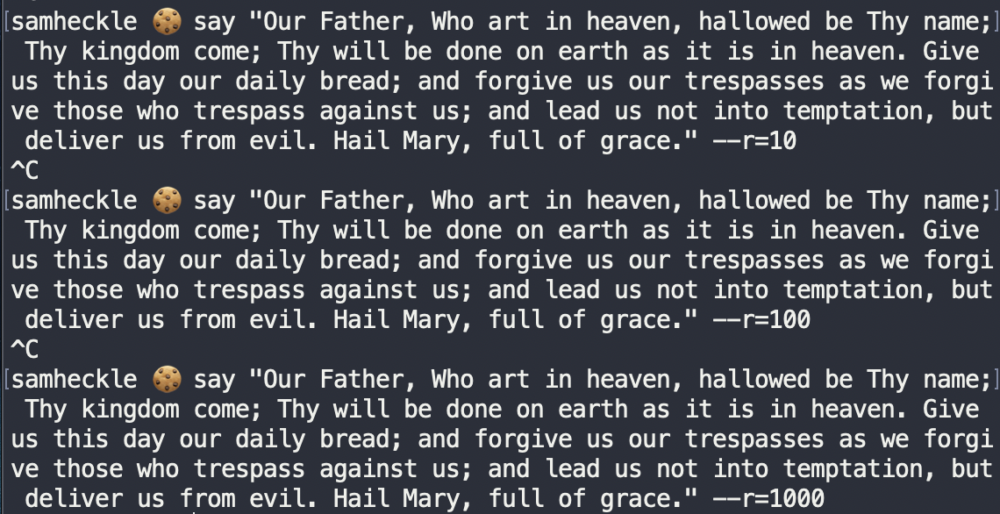

[following this tutorial](https://www.techradar.com/how-to/computing/apple/terminal-101-making-your-mac-talk-with-say-1305649)

but I ended up needing to look up the documentation for the [say library](https://ss64.com/osx/say.html)

# First Tests

My first test I received an error because I don't think the voices work in OS Big Sur.

    say -v "Cellos" "Lalalalalalalalala" -o recording.aiff
    Voice `Cellos' not found.

But after removing the voice flag I was able to get the following output.

    say "Lalalalalalalalala" -o recording.aiff

`audio: /lala.mp3`

# Rate

Here I messed with the rate of the words:

`audio: /rate.mp3`

# Using Large Files

I ended up putting the Our Father prayer into a text file (that is 666 lines long). You can look at the file [here](./prayer.txt)

Here I amped up the speed and added a progress bar for an added effect.

`youtube: https://youtu.be/d1s5-VNDlCg`