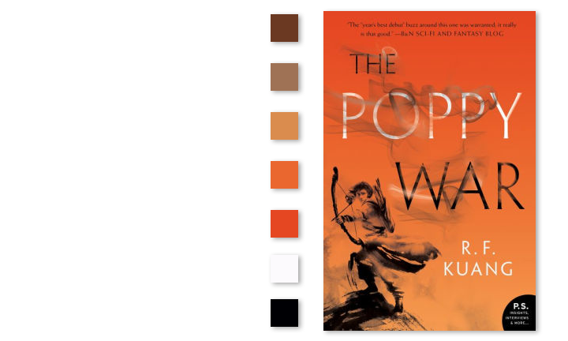
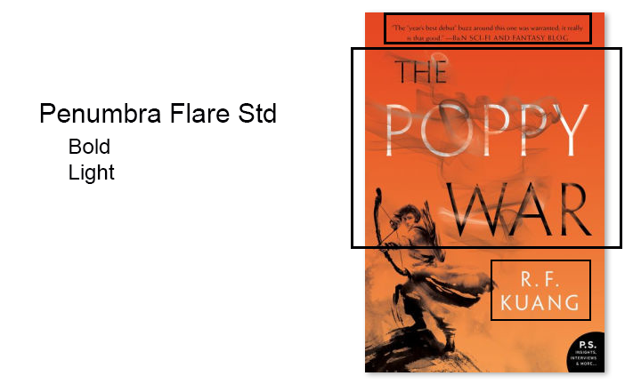
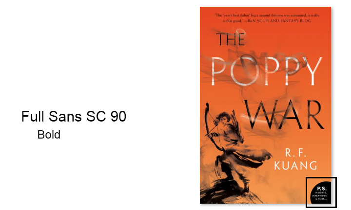
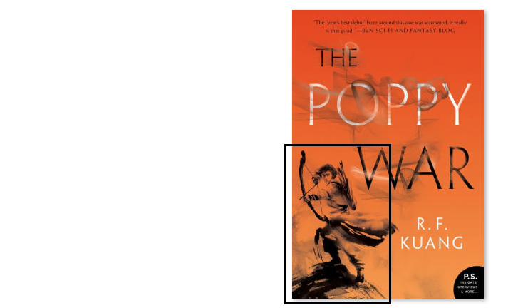
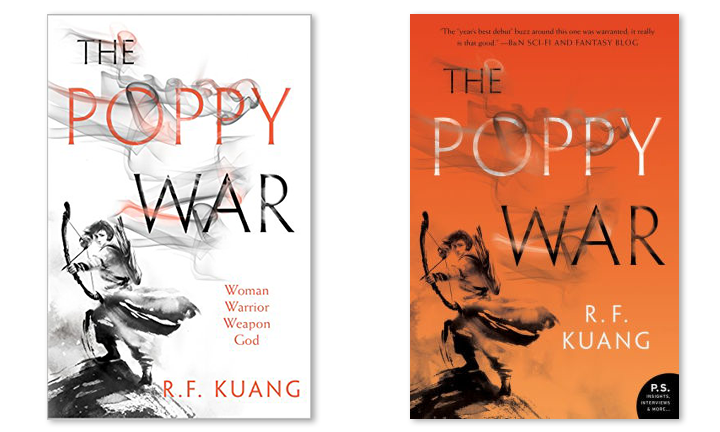
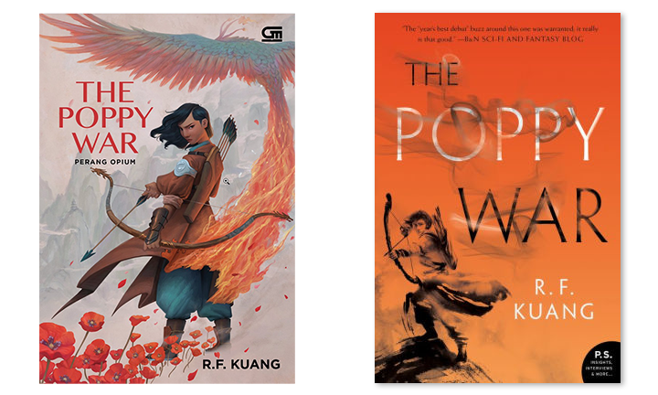

For our week 1 assignment, we were tasked with analyzing a particular design of our choice. I'm an avid book reader (as may be noticed by my bookshelves, arranged by color 🙈), and one of my favorite books I've read in a long time is *The Poppy War* by R. F. Kuang. 

In a nutshell, it is a coming-of-age story where the protagonist (?) Rin is thrown into a world of anger. There are some delicious mythological aspects that tickle my interest in that area, and it touches on the Chinese pantheon. Loosely (and I mean extremely), based in Imperial China, there are references to real world events, but this is purely a work of fiction.

Regardless, let's take a look at the cover. This is the softcover edition of the book.

## Color Story

The first thing that stands out to me is the **color story**. The vibrant orange gradient contrasting the black and white wispy character with white and black text evokes different emotions. 

You can feel the tension in the image, perhaps because everything looks as if it is on fire. The main character illustration appears to be made out of smoke, enhancing the fire concept. 

## Let's Talk about Fonts

The main font on this cover is Penumbra Flare Std. You can see its usage in the title, author, and quote along the top of the image. There are different weights used here, bold used for the title and author, and light used for the quote. This provides some consistency

The second font, Full Sans SC 90, is only in the bottom corner as a publisher's note. It reads "P.S. Insights, Interviews, & More...". Although not legible in this particular image, looking at my physical copy I can see that they make it a little rounder, almost like a tooltip or an afterthought. Both of these fonts are reflected on the spine as well.

## Grid

Looking at the grid, it definitely appears as if the placement of each word was perfectly aligned to abide by the rule of thirds. Starting from the top, the quote is perfectly centered. Moving to the title, "The" lines up with the letter "e" on the first line of the grid. We also see that "War" is aligned in the center of the grid. Our protagonist is kept in the bottom left of the gridspace, adding some interest with the asymmetry of the piece. The author's name is aligned between the bottom two thirds of the grid, which balances out the asymmetry from the character.

## Negative Space

The biggest use of negative space resides in the character, relying on transparency on the lighter orange to create highlights on the image itself. It is extremely effective, because it not only enhances the idea of flames but also may demonstrate some of the character's inner turmoil.

## Other Comparisons

Looking at some of the other editions of the book was an interesting exercise, and here are some of the other ones! 
# Hardcover Edition

This is the comparison of the hardcover edition (left) and the softcover edition (right).

These two are actually nearly identical in style -- the foundation of the image is still there. We still see the main character, and the title in the same locations. I do think that the move of the author's name provides a little more contrast and is more accessible when it is not layered over the character.

# Indonesian Edition

This is the comparison of the Indonesian edition (left) and the softcover edition (right).

These two covers are completely different with an important contextual note - Kuang is an Southeast Asian author currently residing in the UK. Rin, the main character the story follows, is written to share some characteristics with dark-skinned Southeast Asian people. In the Indonesian version, the illustrative design allows for the character to have this correct representation, whereas the cover of both the hard and softcover versions do not allow for that representation since in lieu of coloring the skin the designer used negative space, perhaps even denoting a lighter tone.

