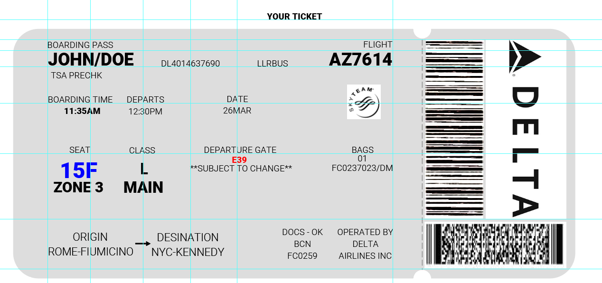
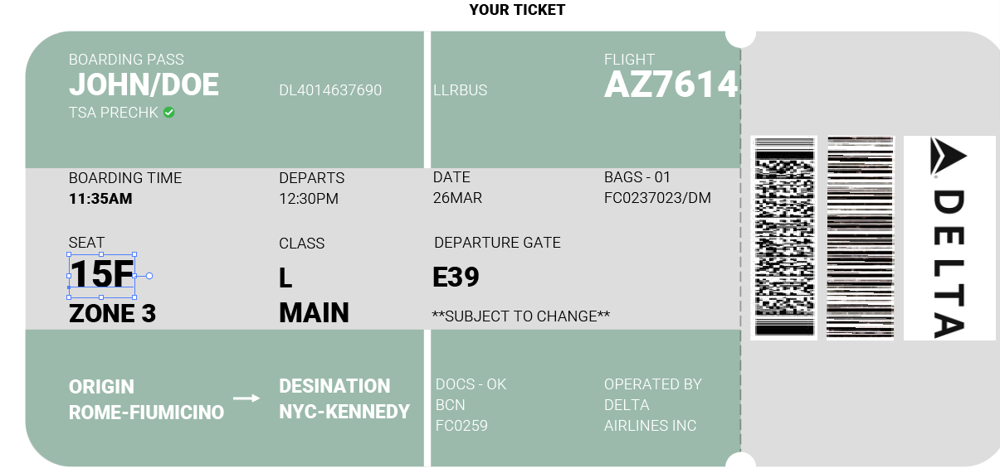
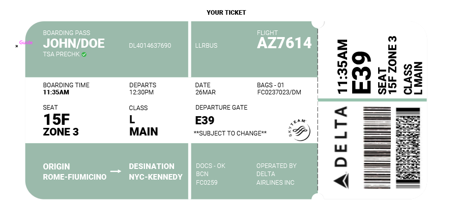
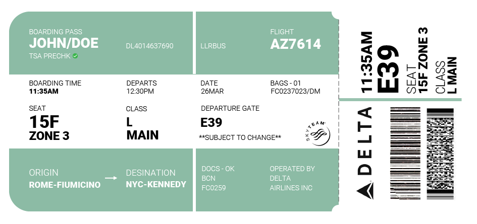
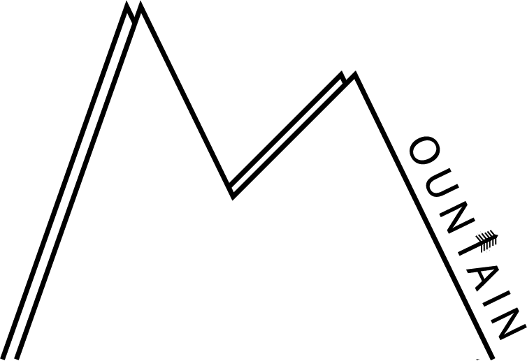
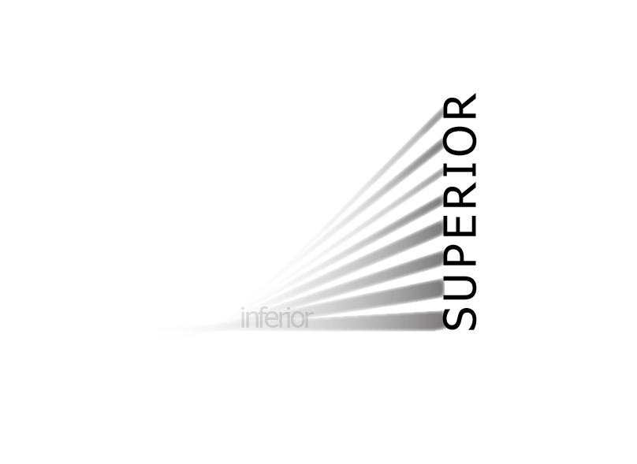

# Plane Ticket Redesign

One of the assignments this week was to redesign an airline ticket. Given a set of information, how can we reformat it to make it look both beautiful and functional?

Below was my first iteration on the design. I knew I had particular elements to focus on, based on previous airport experiences, and highlighted them using different colors. I also started making a first pass at a grid.

Next I focused on adding color to block out the information. I wanted to chunk information that is useful to the passenger vs. information that is useful to airline agents. Green is an accent color I particularly like, but looking back perhaps I should have focused on the branding.

Now I focused on cleanup and making the shape of the ticket myself. This iteration I wanted to change up the way the barcodes were represented. Since I think they are the most important information for the airline, and getting on the plane, they needed to take up a significant amount of space.

#### Final Plane Ticket
Finally, cleaning up some alignment and font size consistency issues and we have the final product!

# Expressive Words

Next we have some expressive words. 

My first word came easily to me. I live in Seattle and am surrounded by beautiful mountain ranges and stunning views. 

Next up I was somewhat intimidated by seeing some other work, and started with the word "inferior". I was not sure if my idea was coming across, but added the word "superior" to add more context.

Finally, and my favorite of the 3 words, is a simple animation with the word "pen". This was only my second time using AE, and I'm pretty proud at how quickly I've gotten used to keyframes. Next up is learning the hotkeys!

Overall I enjoyed delving more into Illustrator. I had no experience prior to this week, and I watched the zoom workshop to become more familiar. By the end of creating the 3 words, I was getting more adapt at pressing the hotkeys for the pen tool (V, A, +, -, and shift+c). Hopefully my flow will get smoother as I become a better designer.