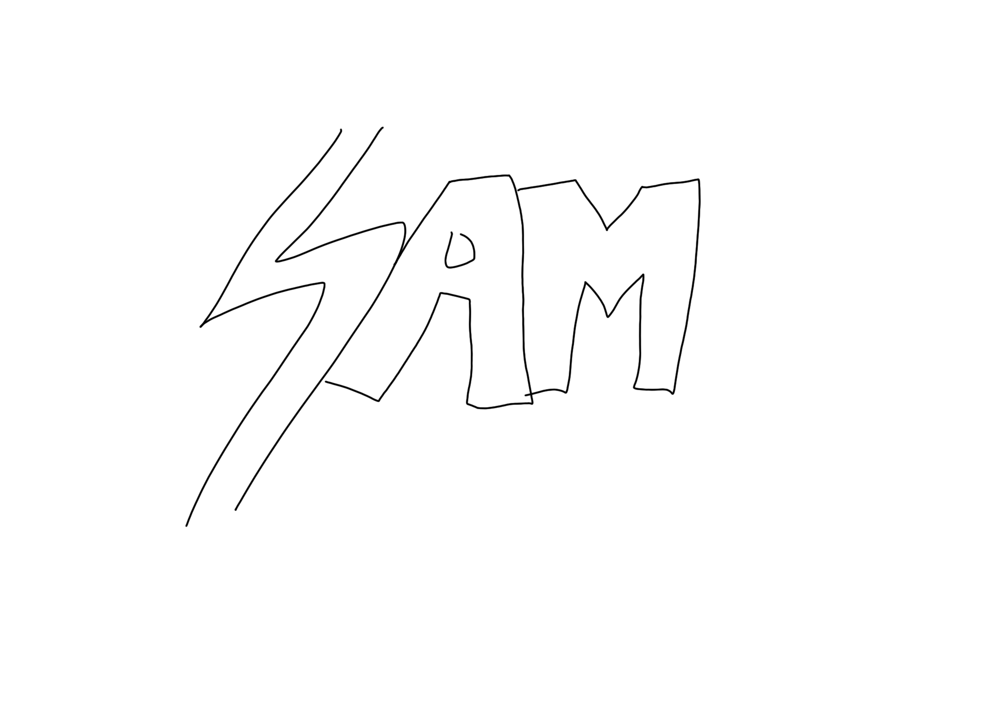
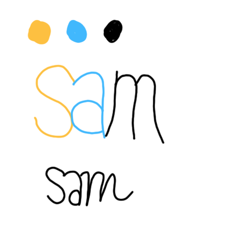
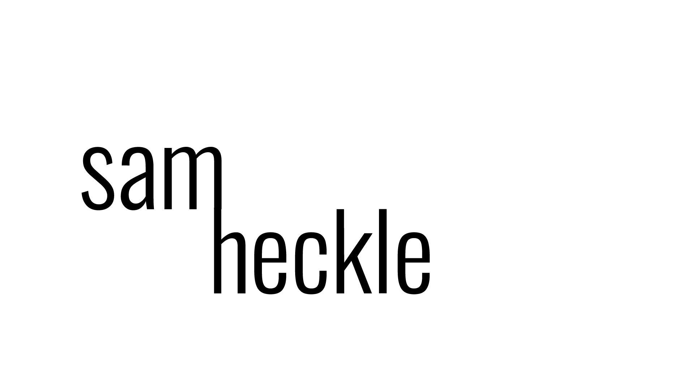
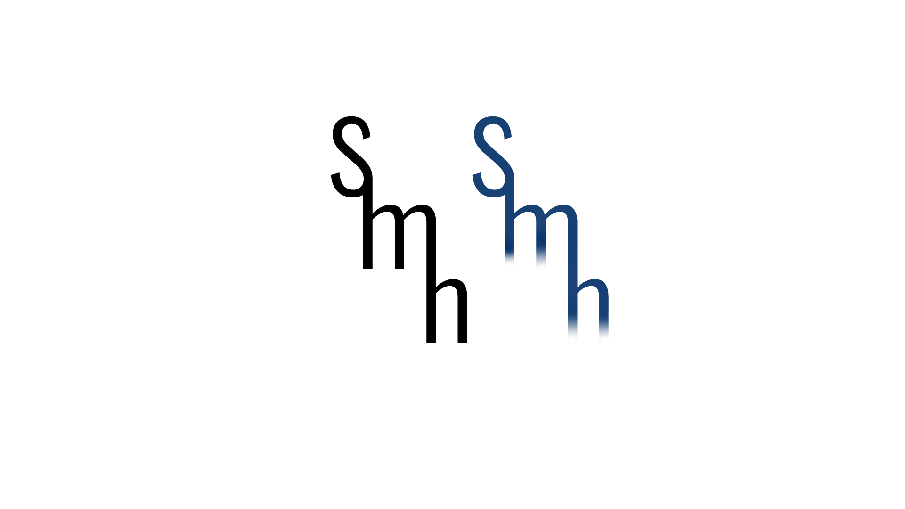
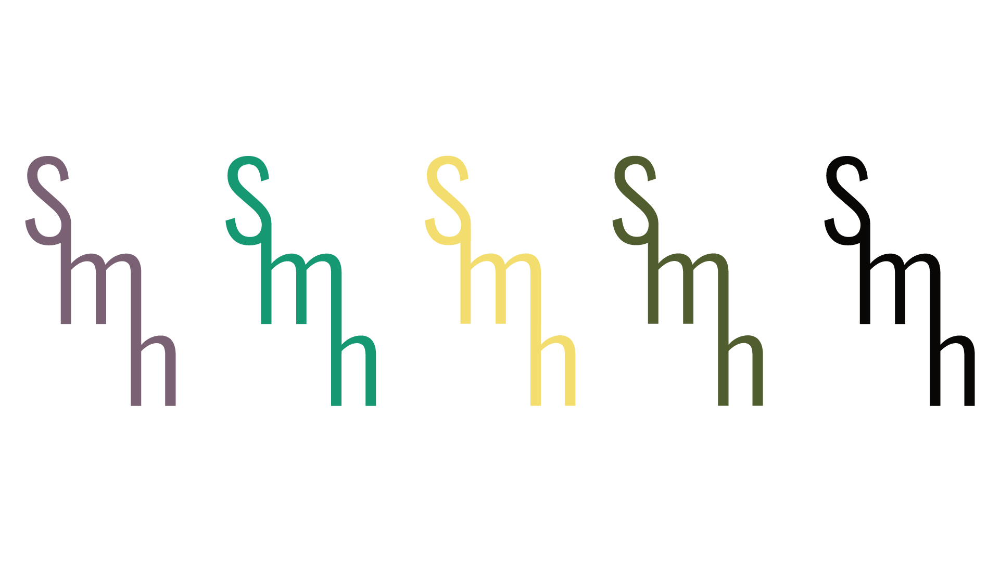
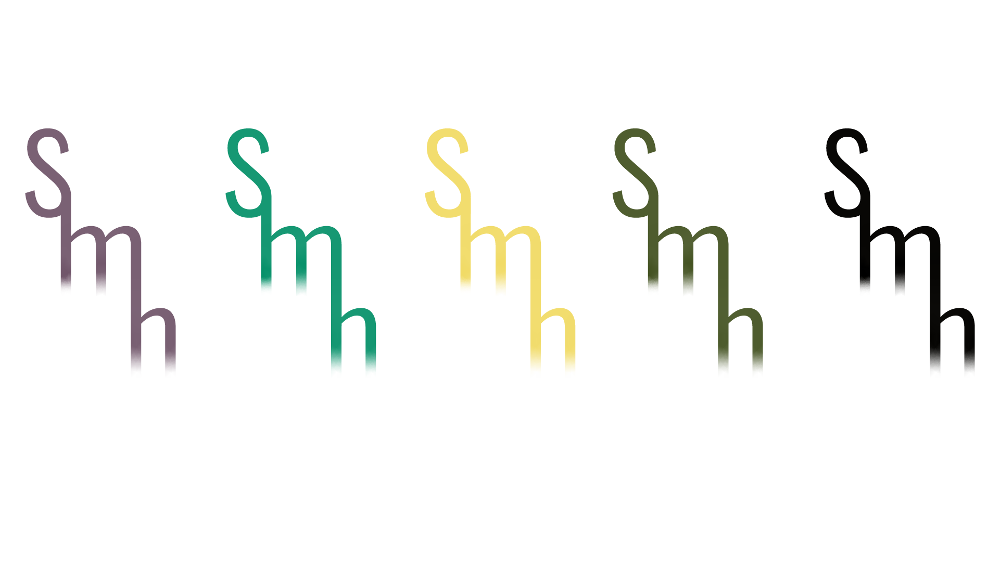

## Sketches translated from sticky notes

I had about 12 sticky notes that had some original ideas, which were all scrapped. I attempted first in photoshop, but quickly realized I don't have the artistic ability to do this by hand.

So, I moved to Illustrator.

## First Attempt

My initial idea stemmed from the idea of "flow". In class on Thursday we made word graphs, and I chose the core word of "mellow". This lead to me thinking of "flow" and "rivers". What I tried to achieve was a flow between letters, and this meant connection. 

My first attempt at getting a flow with my name:

## Two Ideas

Playing with this idea about flow, and going from one letter from the next. I hoped to achieve a "waterfall" effect stemming from flow.

Happy with my logo, I did two recolorings. The first is solid, and the second has the waterfall gradient.
# Final Logo Coloring 1

# Final Logo Coloring 2

# Final Full Name
I ended up squishing my full name, and I like this result more than the previous. 

In the end, I might use these interchangeably, but I will probably stick with my initials.