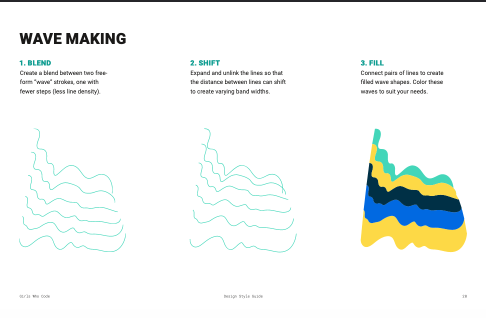
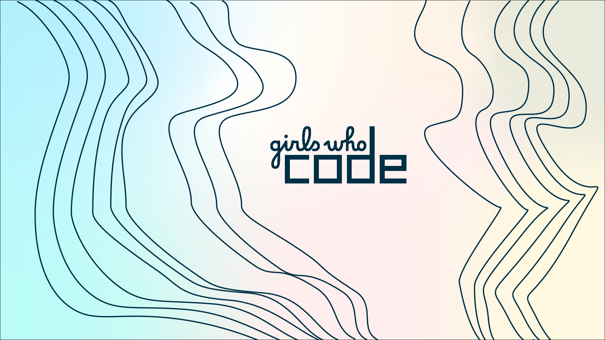
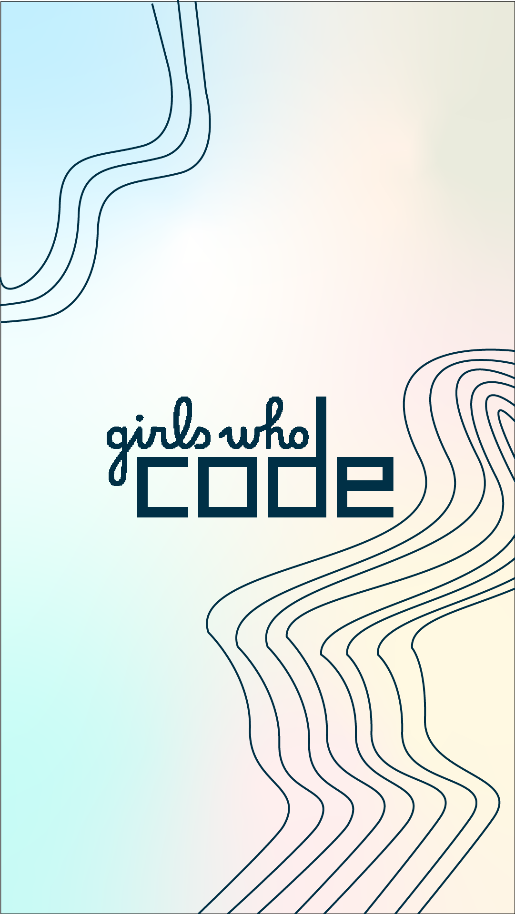

# Idea - Girls Who Code

I based this idea around my passion about involving more women in STEM and specifically computing fields. I am actively a part of Girls Who Code at my workplace, and was able to find [a styleguide](https://girlswhocode.com/assets/downloads/GWC_DesignGuide_Short_z3-2.pdf) for it.

I was particularly inspired by their "wave making" design, and wanted to play around with that.

# Final Iteration

